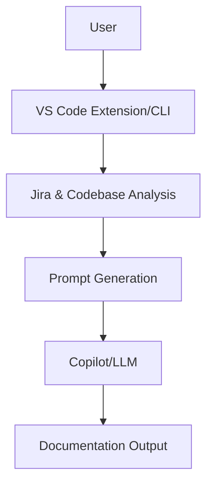

# AI Product Owner Agent

[](https://github.com/your-org/ai-product-owner-agent/actions)
[](LICENSE)

## Overview
The **AI Product Owner Agent** is a VS Code extension and CLI tool that automates the technical analysis of Jira epics and Go codebases. It generates comprehensive, implementation-ready technical documentation and prompt workflows for GitHub Copilot, saving engineering teams days of manual effort and ensuring consistent, high-quality output.

## Key Features
- Automated Jira & Go codebase analysis
- Multi-stage, context-rich prompt generation (Requirements, Design, Technical Design, Infra/NFR, Task Breakdown)
- Copilot/LLM integration for technical analysis
- Structured output: Markdown docs, diagrams, Jira-ready tasks
- Risk assessment, decision log, and reusable documentation

## Quick Start
### VS Code Extension
1. **Install**: Download and install from the VS Code Marketplace or package locally
2. **Configure**: Set up Jira credentials and output preferences
3. **Analyze**: Run "AI Product Owner: Analyze Epic" from the Command Palette
4. **Follow Workflow**: Copy prompts to Copilot, paste responses, and save documentation

### CLI PoC
```bash
python simple_poc.py --demo
# or for real Jira analysis
python simple_poc.py --key PROJ-123 --email user@company.com --token YOUR_TOKEN --url company.atlassian.net
```

## Architecture


## Documentation
- [Product Requirements (PRD)](docs/PRODUCT_REQUIREMENTS.md)
- [Architecture Overview](docs/ARCHITECTURE.md)
- [User Guide](docs/USER_GUIDE.md)
- [Developer Guide](docs/DEVELOPER_GUIDE.md)
- [PoC Guide](docs/POC_GUIDE.md)

## Contributing
See [docs/DEVELOPER_GUIDE.md](docs/DEVELOPER_GUIDE.md) for setup, development, and contribution guidelines.

## License
MIT
