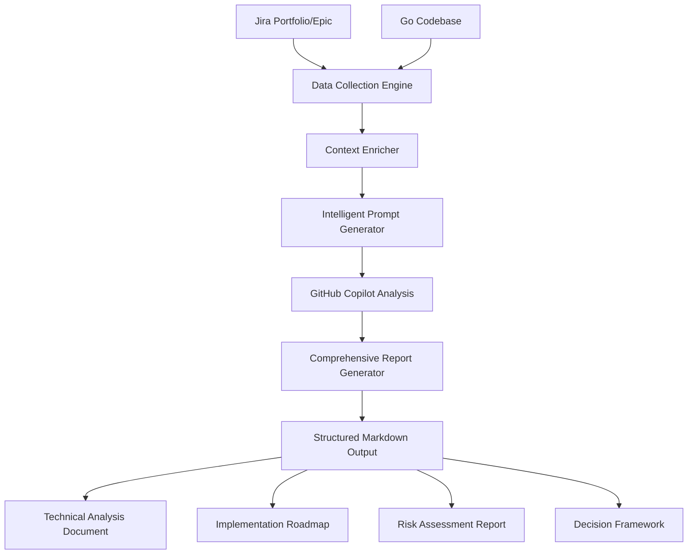

# AI Product Owner Agent - Comprehensive Analysis System

## Executive Summary

Build an AI-powered Product Owner workflow that analyzes Jira Portfolios/Epics, understands Go microservice codebases, and generates comprehensive technical analysis documents using GitHub Copilot's advanced reasoning capabilities.

## Core Problem

**Time Waste**: Senior engineers spend 2-3 days manually analyzing Jira requirements and translating them into technical designs and task breakdowns.

**Inconsistency**: Technical designs vary in quality and detail across different engineers and teams.

**Context Gap**: Limited analysis depth and lack of structured decision-making frameworks lead to suboptimal technical decisions.

**Analysis Gaps**: Missing risk assessment, dependency analysis, alternative approaches evaluation, and implementation roadmaps.

## Solution Architecture



## Core Features

### 1. Smart Jira Analysis
- **Portfolio/Epic Fetching**: Extract requirements, stories, acceptance criteria, and business context
- **Effort Classification**: Identify if work is backend-heavy, frontend-heavy, or full-stack
- **Dependency Detection**: Find cross-team dependencies (frontend, external APIs, infrastructure)
- **Business Impact Analysis**: Understand strategic importance and user value

### 2. Deep Codebase Intelligence
- **Architecture Detection**: Identify patterns (layered, DDD, hexagonal, microservices)
- **API Mapping**: Catalog existing endpoints, handlers, and integration points
- **Database Analysis**: Map models, relationships, and migration strategy
- **Dependency Analysis**: External libraries, internal modules, and service mesh
- **Performance Patterns**: Identify scalability and performance considerations
- **Security Context**: Authentication, authorization, and data protection patterns

### 3. Comprehensive Copilot Analysis Engine
- **Multi-Perspective Analysis**: Technical, business, and operational viewpoints
- **Alternative Solutions**: Generate and compare 3-5 different implementation approaches
- **Risk Assessment Matrix**: Identify technical, operational, and business risks
- **Impact Analysis**: Understand effects on existing systems and team workflows
- **Decision Framework**: Structured pros/cons analysis with recommendation rationale

### 4. Advanced Prompt Engineering
- **Contextual Prompts**: Rich, structured prompts with complete business and technical context
- **Chain-of-Thought Reasoning**: Guide Copilot through systematic analysis steps
- **Multi-Stage Analysis**: Progressive refinement from high-level to detailed implementation
- **Validation Prompts**: Cross-check assumptions and validate technical decisions

### 5. Structured Documentation Output
- **Executive Summary**: High-level overview for stakeholders
- **Technical Deep Dive**: Detailed implementation analysis for engineers
- **Implementation Roadmap**: Phased approach with milestones and dependencies
- **Risk Mitigation Plan**: Identified risks with specific mitigation strategies
- **Jira Task Breakdown**: Ready-to-import epics, stories, and subtasks
- **Decision Log**: Rationale for chosen approach and rejected alternatives

## Technical Implementation

### Core System Architecture

```python
class ComprehensiveAnalysisEngine:
    def __init__(self):
        self.jira_client = JiraClient()
        self.codebase_analyzer = GoProjectAnalyzer()
        self.prompt_generator = AdvancedPromptGenerator()
        self.report_generator = ComprehensiveReportGenerator()
    
    async def generate_full_analysis(self, epic_key: str, project_path: str):
        # 1. Data Collection Phase
        jira_data = await self.jira_client.fetch_comprehensive_data(epic_key)
        codebase_insights = await self.codebase_analyzer.deep_analysis(project_path)
        
        # 2. Context Enrichment
        enriched_context = self.enrich_context(jira_data, codebase_insights)
        
        # 3. Multi-Stage Copilot Analysis
        analysis_results = await self.run_copilot_analysis_pipeline(enriched_context)
        
        # 4. Generate Comprehensive Report
        final_report = self.report_generator.create_markdown_report(analysis_results)
        
        return final_report
```

### Advanced Prompt Engineering Strategy

#### Phase 1: Context Setting Prompt
```python
CONTEXT_SETTING_PROMPT = """
# AI Product Owner Analysis - Context Setting

You are a senior technical product owner with 10+ years of experience in:
- Go microservices architecture
- Enterprise software design
- Risk assessment and mitigation
- Agile development methodologies
- System integration patterns

## Your Analysis Framework:
1. **Business Context First**: Always understand the business value and user impact
2. **Technical Depth**: Analyze architecture, performance, security, and scalability
3. **Risk-Driven Decisions**: Identify and assess technical and operational risks
4. **Alternative Thinking**: Consider multiple implementation approaches
5. **Practical Implementation**: Focus on actionable, implementable solutions

## Analysis Standards:
- Use structured thinking with clear reasoning chains
- Provide concrete examples and specific recommendations
- Consider both immediate and long-term implications
- Include quantitative assessments where possible
- Maintain focus on business outcomes while ensuring technical excellence

## Output Requirements:
- Clear executive summaries for stakeholders
- Detailed technical analysis for engineering teams
- Actionable implementation plans with specific tasks
- Risk assessments with mitigation strategies
- Comparative analysis of alternative approaches

Are you ready to analyze the following project requirements and codebase?
"""

JIRA_ANALYSIS_PROMPT = """
# Business Requirements Analysis

## Jira Epic/Portfolio Data:
{jira_context}

## Analysis Tasks:

### 1. Business Context Analysis
- Extract the core business problem being solved
- Identify target users and their needs
- Assess business value and strategic importance
- Understand success metrics and acceptance criteria

### 2. Requirements Deep Dive
- Break down epics into logical feature groups
- Identify functional and non-functional requirements
- Spot potential scope creep or ambiguous requirements
- Highlight cross-functional dependencies

### 3. Risk Assessment
- Identify business risks (market, competition, timeline)
- Assess requirement clarity and completeness
- Flag potential scope or complexity issues
- Evaluate team and stakeholder alignment

Please provide a comprehensive analysis following this framework.
"""

CODEBASE_ANALYSIS_PROMPT = """
# Technical Architecture Analysis

## Current Codebase Context:
{codebase_context}

## Analysis Framework:

### 1. Architecture Assessment
- Evaluate current architectural patterns and their effectiveness
- Identify technical debt and architectural constraints
- Assess scalability and performance characteristics
- Review security and data protection implementations

### 2. Integration Points Analysis
- Map existing APIs and service boundaries
- Identify data flow patterns and dependencies
- Assess external service integrations
- Review database schema and data access patterns

### 3. Development Readiness
- Evaluate code quality and maintainability
- Assess testing coverage and strategies
- Review deployment and operational procedures
- Identify development workflow and tooling

### 4. Constraint Identification
- Technical limitations of current stack
- Performance bottlenecks and scaling challenges
- Security vulnerabilities or compliance gaps
- Operational and maintenance overhead

Provide detailed analysis with specific examples from the codebase.
"""

SOLUTION_DESIGN_PROMPT = """
# Comprehensive Solution Design

## Context:
**Business Requirements:** {business_summary}
**Technical Constraints:** {technical_summary}

## Design Challenge:
Create a comprehensive technical solution that addresses the business requirements while working within the identified technical constraints.

## Required Analysis:

### 1. Solution Architecture Design
Generate 3-5 different implementation approaches:

For each approach, provide:
- **Architecture Overview**: High-level design with key components
- **Technology Stack**: Specific technologies and frameworks
- **Implementation Complexity**: Development effort and timeline
- **Pros and Cons**: Detailed trade-off analysis
- **Risk Assessment**: Technical and operational risks
- **Scalability Considerations**: Performance and growth planning

### 2. Recommended Solution
- **Chosen Approach**: Which solution you recommend and why
- **Decision Rationale**: Detailed reasoning with trade-off analysis
- **Success Metrics**: How to measure implementation success
- **Risk Mitigation**: Specific strategies for identified risks

### 3. Implementation Strategy
- **Phase Breakdown**: Logical development phases
- **Milestone Planning**: Key deliverables and checkpoints
- **Team Requirements**: Skills and resources needed
- **Timeline Estimation**: Realistic development schedule

### 4. Technical Specifications
- **API Design**: Endpoint specifications and data contracts
- **Database Design**: Schema changes and migration strategy
- **Integration Points**: External service connections
- **Security Implementation**: Authentication, authorization, encryption
- **Testing Strategy**: Unit, integration, and acceptance testing
- **Deployment Plan**: CI/CD pipeline and infrastructure requirements

Please provide comprehensive analysis with specific technical details and actionable recommendations.
"""

JIRA_BREAKDOWN_PROMPT = """
# Implementation Task Breakdown

## Solution Context:
{solution_summary}

## Task: Generate Jira Epic and Story Structure

Create a comprehensive breakdown that includes:

### 1. Epic Structure
- **Epic Categories**: Group related functionality (e.g., API Development, Database, Security)
- **Epic Prioritization**: Sequence based on dependencies and business value
- **Epic Sizing**: Effort estimation and timeline

### 2. Story Breakdown
For each epic, create detailed stories with:
- **Story Title**: Clear, user-focused titles
- **Acceptance Criteria**: Specific, testable requirements
- **Story Points**: Effort estimation using Fibonacci scale
- **Definition of Done**: Quality and completion criteria
- **Dependencies**: Links to other stories or external dependencies

### 3. Subtask Details
For complex stories, provide:
- **Technical Tasks**: Specific development activities
- **Testing Tasks**: Unit, integration, and acceptance testing
- **Documentation Tasks**: Technical and user documentation
- **Review Tasks**: Code review and quality assurance

### 4. Implementation Sequence
- **Sprint Planning**: Logical grouping for 2-week sprints
- **Critical Path**: Dependencies that could block progress
- **Parallel Work**: Tasks that can be developed simultaneously
- **Risk Mitigation**: Backup plans for high-risk items

Output in a format ready for Jira import with proper hierarchy and linking.
"""
```

### Comprehensive Report Generator

```python
class ComprehensiveReportGenerator:
    def create_markdown_report(self, analysis_results: Dict) -> str:
        return f"""
# Technical Analysis Report - {analysis_results['epic_key']}

## Executive Summary
{self._generate_executive_summary(analysis_results)}

## Business Context Analysis
{self._generate_business_analysis(analysis_results)}

## Technical Architecture Assessment
{self._generate_technical_analysis(analysis_results)}

## Solution Design & Alternatives
{self._generate_solution_design(analysis_results)}

## Risk Assessment & Mitigation
{self._generate_risk_analysis(analysis_results)}

## Implementation Roadmap
{self._generate_implementation_plan(analysis_results)}

## Jira Task Breakdown
{self._generate_jira_breakdown(analysis_results)}

## Decision Log & Rationale
{self._generate_decision_log(analysis_results)}

## Open Questions & Dependencies
{self._generate_open_questions(analysis_results)}

## Appendix: Technical Specifications
{self._generate_technical_specs(analysis_results)}
        """

    def _generate_executive_summary(self, results: Dict) -> str:
        """Generate stakeholder-friendly summary"""
        
    def _generate_solution_design(self, results: Dict) -> str:
        """Generate solution architecture with diagrams"""
        
    def _generate_risk_analysis(self, results: Dict) -> str:
        """Generate risk matrix with mitigation strategies"""
```

### Multi-Stage Analysis Pipeline

```python
class AdvancedPromptGenerator:
    def generate_analysis_pipeline(self, jira_data: Dict, codebase_data: Dict) -> List[PromptStage]:
        return [
            # Stage 1: Context Setting & Role Definition
            PromptStage(
                name="context_setting",
                prompt=self.CONTEXT_SETTING_PROMPT,
                expected_output="confirmation_and_clarifications"
            ),
            
            # Stage 2: Business Requirements Analysis  
            PromptStage(
                name="business_analysis",
                prompt=self.JIRA_ANALYSIS_PROMPT.format(jira_context=jira_data),
                expected_output="business_requirements_analysis"
            ),
            
            # Stage 3: Technical Architecture Assessment
            PromptStage(
                name="technical_analysis", 
                prompt=self.CODEBASE_ANALYSIS_PROMPT.format(codebase_context=codebase_data),
                expected_output="technical_architecture_assessment"
            ),
            
            # Stage 4: Solution Design & Alternatives
            PromptStage(
                name="solution_design",
                prompt=self.SOLUTION_DESIGN_PROMPT.format(
                    business_summary="{business_analysis}",
                    technical_summary="{technical_analysis}"
                ),
                expected_output="comprehensive_solution_design"
            ),
            
            # Stage 5: Implementation Planning
            PromptStage(
                name="implementation_planning",
                prompt=self.JIRA_BREAKDOWN_PROMPT.format(
                    solution_summary="{solution_design}"
                ),
                expected_output="detailed_implementation_plan"
            ),
            
            # Stage 6: Validation & Review
            PromptStage(
                name="validation_review",
                prompt=self.VALIDATION_PROMPT.format(
                    complete_analysis="{all_previous_stages}"
                ),
                expected_output="validated_final_report"
            )
        ]

VALIDATION_PROMPT = """
# Final Validation & Quality Assurance

## Complete Analysis Review:
{complete_analysis}

## Validation Tasks:

### 1. Completeness Check
- Verify all business requirements are addressed
- Ensure technical constraints are properly handled
- Confirm implementation plan covers all aspects
- Validate risk assessment is comprehensive

### 2. Consistency Verification
- Check alignment between business needs and technical solution
- Verify implementation plan matches solution design
- Ensure risk mitigations address identified risks
- Validate Jira breakdown reflects implementation plan

### 3. Quality Assessment
- Assess technical solution feasibility and quality
- Review effort estimates for reasonableness
- Evaluate risk assessment accuracy
- Check completeness of documentation

### 4. Final Recommendations
- Highlight any gaps or concerns
- Suggest additional considerations
- Recommend modifications if needed
- Confirm readiness for implementation

Provide final validation report with any necessary corrections or enhancements.
"""
```

### Expected Output Format

The comprehensive analysis system generates structured markdown reports with the following sections:

```markdown
# Technical Analysis Report - [EPIC-KEY]

## 📋 Executive Summary
- **Business Objective**: Clear statement of business goals
- **Technical Approach**: High-level solution overview  
- **Key Risks**: Top 3 risks with mitigation strategies
- **Timeline**: Estimated delivery timeline with key milestones
- **Resource Requirements**: Team size and skill requirements

## 🎯 Business Context Analysis
- **Problem Statement**: Core business problem being solved
- **User Impact**: Target users and their benefits
- **Success Metrics**: Measurable business outcomes
- **Stakeholder Analysis**: Key stakeholders and their concerns

## 🏗️ Technical Architecture Assessment  
- **Current State**: Existing system capabilities and constraints
- **Gap Analysis**: What needs to be built or modified
- **Integration Points**: External systems and APIs
- **Scalability Considerations**: Performance and growth planning

## 💡 Solution Design & Alternatives
- **Approach 1**: [Recommended] Detailed design with rationale
- **Approach 2**: Alternative with pros/cons comparison
- **Approach 3**: Additional option if applicable
- **Decision Matrix**: Scoring criteria and final recommendation

## ⚠️ Risk Assessment & Mitigation
- **Technical Risks**: Implementation challenges and solutions
- **Operational Risks**: Deployment and maintenance concerns  
- **Business Risks**: Timeline, scope, and market considerations
- **Mitigation Strategies**: Specific actions for each risk

## 🗺️ Implementation Roadmap
- **Phase 1**: Foundation (Weeks 1-4)
- **Phase 2**: Core Development (Weeks 5-10)  
- **Phase 3**: Integration & Testing (Weeks 11-14)
- **Dependencies**: External blockers and coordination points

## 📋 Jira Task Breakdown
- **Epic Structure**: Organized by functional areas
- **User Stories**: Detailed with acceptance criteria
- **Story Points**: Effort estimation for sprint planning
- **Sprint Planning**: Logical grouping for 2-week sprints

## 📝 Decision Log & Rationale
- **Technology Choices**: Framework and library decisions
- **Architecture Decisions**: Design pattern justifications
- **Trade-off Analysis**: What was considered and why

## ❓ Open Questions & Dependencies
- **Technical Unknowns**: Areas needing further investigation
- **Business Clarifications**: Requirements needing stakeholder input
- **External Dependencies**: Third-party integrations and timelines
```

## Implementation Plan

### Phase 1: Enhanced POC (Weeks 1-2)
**Objective**: Upgrade current POC with comprehensive analysis capabilities

**Deliverables**:
- Enhanced prompt engineering system
- Multi-stage Copilot analysis pipeline  
- Comprehensive report generation
- Improved Jira data extraction
- Advanced codebase analysis

**Technical Tasks**:
- Implement `AdvancedPromptGenerator` class
- Create structured prompt templates
- Build `ComprehensiveReportGenerator`
- Add diagram generation capabilities
- Enhance error handling and validation

### Phase 2: Production System (Weeks 3-6)
**Objective**: Build production-ready analysis system

**Deliverables**:
- Robust CLI application
- Configuration management
- Error handling and recovery
- Performance optimization
- Documentation and examples

**Technical Tasks**:
- Implement full analysis pipeline
- Add configuration file support
- Create validation and quality checks
- Build report templating system
- Add export formats (PDF, HTML)

### Phase 3: Integration & Automation (Weeks 7-8)
**Objective**: Enable seamless workflow integration

**Deliverables**:
- CI/CD integration
- Jira automation hooks
- Team workflow integration
- Training materials
- Success metrics dashboard

**Technical Tasks**:
- Create GitHub Actions workflows
- Build Jira webhook integrations
- Develop team onboarding guides
- Implement usage analytics
- Create feedback collection system

## Success Metrics

### Quantitative Goals
- **Time Savings**: Reduce analysis time from 2-3 days to 3-4 hours (85% reduction)
- **Analysis Completeness**: 100% coverage of business, technical, and risk dimensions
- **Decision Quality**: 95% of analysis includes 3+ alternative approaches with detailed comparison
- **Implementation Readiness**: 90% of generated roadmaps are directly actionable
- **Team Adoption**: 80% of product owners and tech leads using the system within 2 months

### Qualitative Goals  
- **Strategic Clarity**: Clear business-to-technical requirement translation
- **Risk Awareness**: Proactive identification of project risks and dependencies
- **Decision Traceability**: Full rationale for technical choices and trade-offs
- **Knowledge Transfer**: Standardized analysis format improves cross-team communication
- **Implementation Confidence**: Teams have clear roadmaps with realistic estimates

## Key Differentiators

### Beyond Simple Prompting
- **Multi-Stage Analysis**: Progressive refinement through structured analysis phases
- **Alternative Evaluation**: Systematic comparison of 3-5 implementation approaches
- **Risk-First Thinking**: Comprehensive risk assessment with specific mitigation strategies
- **Implementation Focus**: Detailed task breakdown ready for sprint planning

### Comprehensive Context Understanding
- **Business Context**: Deep understanding of user needs and business objectives
- **Technical Constraints**: Full analysis of existing system limitations and capabilities
- **Operational Requirements**: Deployment, monitoring, and maintenance considerations
- **Team Dynamics**: Resource availability and skill set considerations

### Actionable Output
- **Executive Summaries**: Clear communication for stakeholders and management
- **Technical Specifications**: Detailed implementation guidance for engineering teams
- **Project Planning**: Ready-to-use Jira epics, stories, and task breakdowns
- **Decision Documentation**: Complete rationale for future reference and learning

## Next Steps

### Immediate Actions (This Week)
1. **✅ POC Validation**: Current POC demonstrates core workflow feasibility
2. **📝 Prompt Development**: Create and test comprehensive prompt templates
3. **🔧 System Design**: Design multi-stage analysis pipeline architecture
4. **📋 Report Templates**: Define structured output format and sections

### Short-term Goals (Next 2 Weeks)  
1. **🚀 Enhanced Implementation**: Build comprehensive analysis system
2. **🧪 Validation Testing**: Test with real Jira epics and Go codebases
3. **📊 Quality Metrics**: Establish success criteria and measurement framework
4. **👥 Stakeholder Review**: Get feedback from potential users and stakeholders

### Medium-term Vision (Next 2 Months)
1. **🔄 Production Deployment**: Roll out to engineering teams
2. **📈 Usage Analytics**: Monitor adoption and effectiveness metrics
3. **🔧 Continuous Improvement**: Iterate based on user feedback and results
4. **📚 Knowledge Base**: Build library of successful analysis patterns and templates
