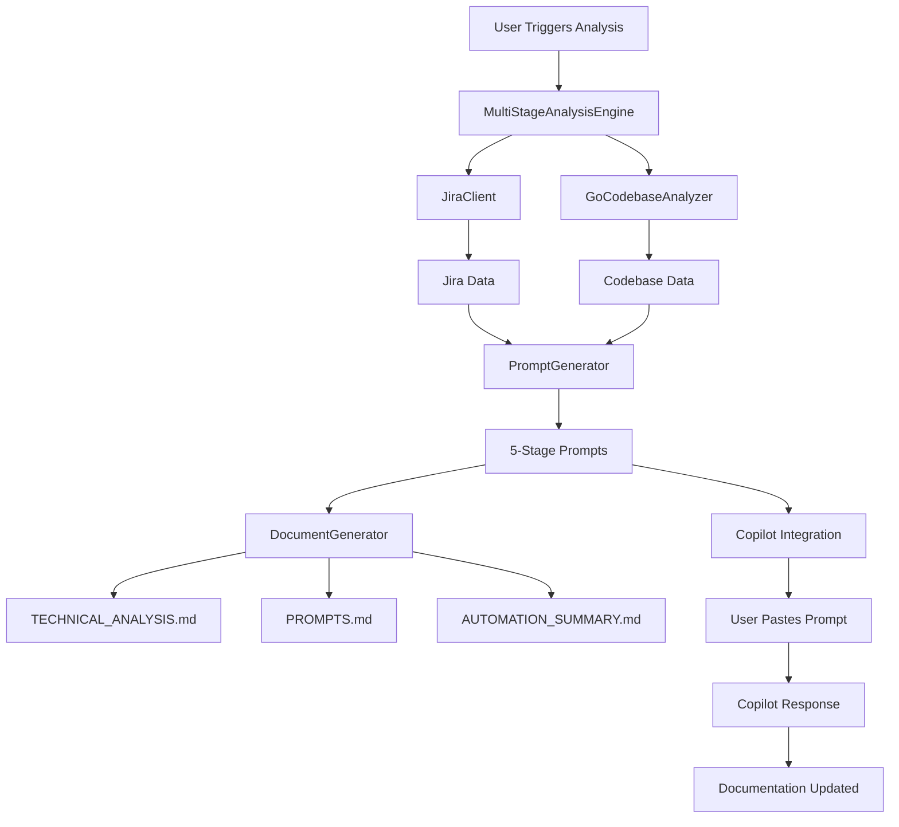
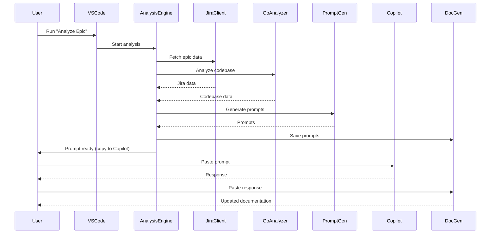
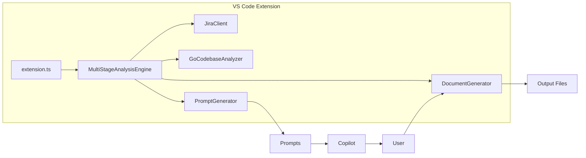

# AI Product Owner Agent - Architecture Overview

## High-Level Workflow

## Component Overview
- **extension.ts**: Entry point, command registration
- **MultiStageAnalysisEngine**: Orchestrates the workflow, manages progress, coordinates all components
- **JiraClient**: Fetches and parses Jira epic/portfolio data
- **GoCodebaseAnalyzer**: Analyzes Go project structure, patterns, and complexity
- **PromptGenerator**: Creates context-rich, multi-stage prompts using best practices
- **DocumentGenerator**: Manages output files and documentation

## Sequence Diagram: End-to-End Analysis

## Roles & Responsibilities
- **User**: Triggers analysis, pastes prompts into Copilot, saves responses
- **Extension**: Automates data collection, prompt generation, and documentation
- **Copilot/LLM**: Provides technical analysis and recommendations

## Visual: Component Interactions

## Prompt Engineering Best Practices
- Context-rich, multi-step prompts
- Explicit role and task instructions
- Use of XML/structured tags and thinking steps
- Sequential, progressive analysis (each stage builds on previous)
- Visual requirements (Mermaid diagrams)

## Output Artifacts
- `TECHNICAL_ANALYSIS.md`: Main analysis doc
- `PROMPTS.md`: All generated prompts
- `AUTOMATION_SUMMARY.md`: Workflow summary

---
*For user and developer instructions, see [USER_GUIDE.md](USER_GUIDE.md) and [DEVELOPER_GUIDE.md](DEVELOPER_GUIDE.md).* 