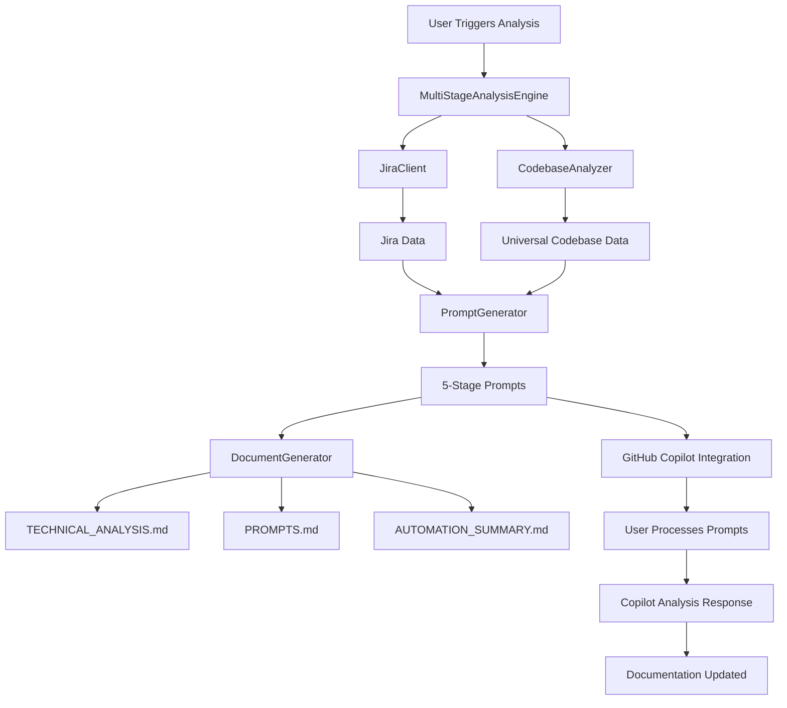
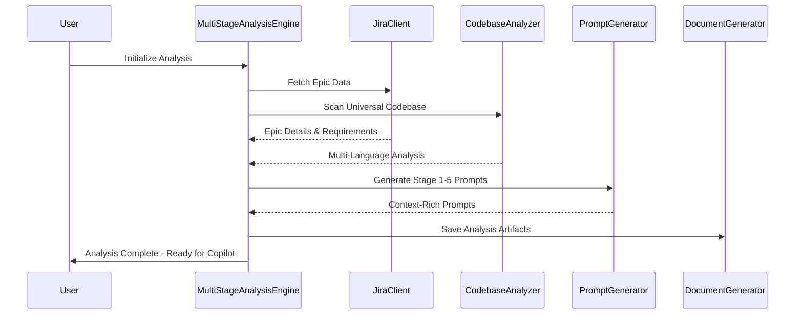
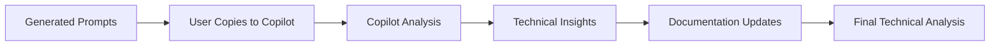

# AI Product Owner Agent - System Architecture

## Overview

The AI Product Owner Agent is a VS Code extension that provides automated technical analysis for Jira epics and universal codebase analysis across multiple programming languages. The system generates comprehensive technical documentation through a multi-stage analysis workflow integrated with GitHub Copilot.

## Supported Languages

The universal codebase analyzer supports the following programming languages:
- **JavaScript** (.js, .mjs)
- **TypeScript** (.ts, .tsx)
- **Python** (.py)
- **Java** (.java)
- **Go** (.go)
- **C#** (.cs)
- **PHP** (.php)
- **Ruby** (.rb)
- **Rust** (.rs)

## Architecture Overview

## Core Components

### MultiStageAnalysisEngine
- **Purpose**: Central orchestrator managing the complete analysis workflow
- **Responsibilities**: Progress tracking, stage coordination, user interaction dialogs
- **Key Features**: Five-stage analysis process with user confirmation at each stage

### JiraClient
- **Purpose**: Integration with Jira REST API for epic and portfolio data retrieval
- **Responsibilities**: Authentication, data fetching, error handling
- **Key Features**: Configurable Jira instance support, comprehensive epic analysis

### CodebaseAnalyzer (Universal)
- **Purpose**: Multi-language code analysis engine
- **Responsibilities**: File discovery, pattern recognition, complexity assessment
- **Key Features**: 
  - Language-agnostic structure analysis
  - Dependency mapping across languages
  - Code quality metrics
  - Architecture pattern detection

### PromptGenerator
- **Purpose**: Context-rich prompt creation for GitHub Copilot
- **Responsibilities**: Template management, data integration, prompt optimization
- **Key Features**: Five-stage prompt sequence, XML-structured output, role-based instructions

### DocumentGenerator
- **Purpose**: Output file management and documentation generation
- **Responsibilities**: File creation, template rendering, artifact organization
- **Key Features**: Markdown generation, Mermaid diagram support, structured output
## Analysis Workflow

### Five-Stage Analysis Process

### Stage Breakdown

1. **Epic Analysis**: Requirement extraction and business context
2. **Codebase Architecture**: Universal language structure analysis
3. **Technical Dependencies**: Cross-language dependency mapping
4. **Implementation Planning**: Development strategy and approach
5. **Documentation Generation**: Comprehensive technical documentation

## System Integration

### GitHub Copilot Workflow

### Configuration Management
- **Settings**: Jira connection, analysis preferences
- **Authentication**: Secure credential storage
- **Validation**: Connection testing and error handling

## Output Artifacts

### Primary Documentation
- **TECHNICAL_ANALYSIS.md**: Comprehensive technical analysis
- **PROMPTS.md**: All generated prompts for transparency
- **AUTOMATION_SUMMARY.md**: Workflow execution summary

### Visual Documentation
- **Architecture Diagrams**: Mermaid-based system visualization
- **Dependency Maps**: Cross-language relationship mapping
- **Flow Charts**: Process and data flow documentation

## Quality Assurance

### Testing Strategy
- **Unit Tests**: Core component validation
- **Integration**: VS Code API compatibility
- **Error Handling**: Comprehensive error recovery

### Performance Considerations
- **Caching**: Jira data and analysis results
- **Progressive Loading**: Staged analysis execution
- **Memory Management**: Efficient resource utilization

## Security & Compliance

### Authentication
- **Jira Integration**: Secure API token management
- **VS Code Integration**: Extension security model
- **Data Privacy**: Local processing, no external data transmission

### Best Practices
- **Input Validation**: Secure data handling
- **Error Logging**: Comprehensive audit trail
- **Configuration Security**: Encrypted credential storage

---

*For detailed usage instructions, see [USER_GUIDE.md](USER_GUIDE.md). For development information, see [DEVELOPER_GUIDE.md](DEVELOPER_GUIDE.md).*