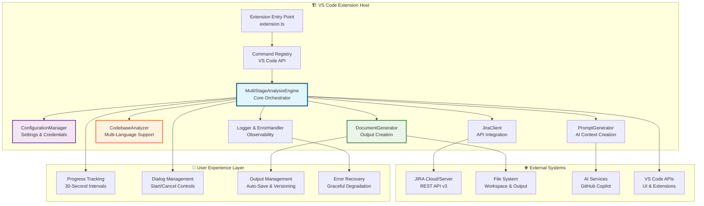
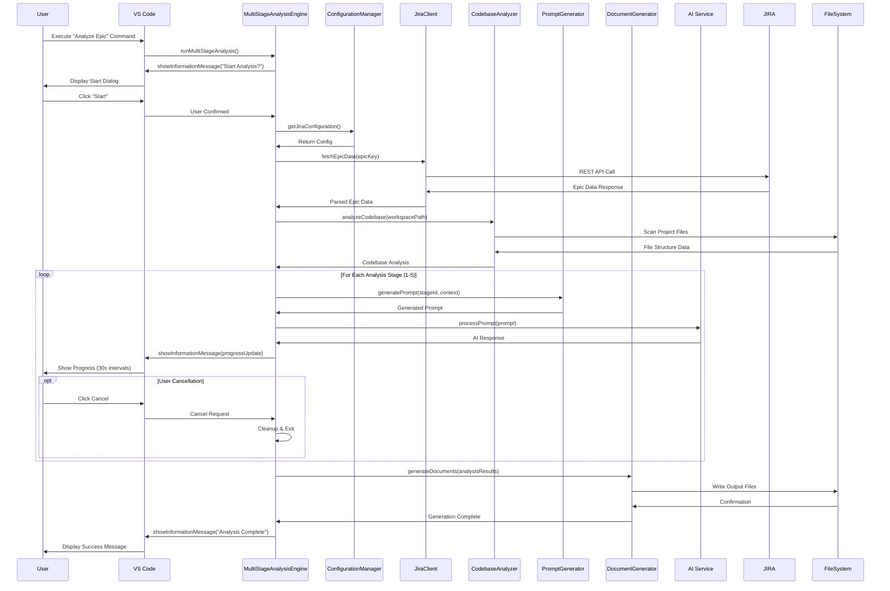
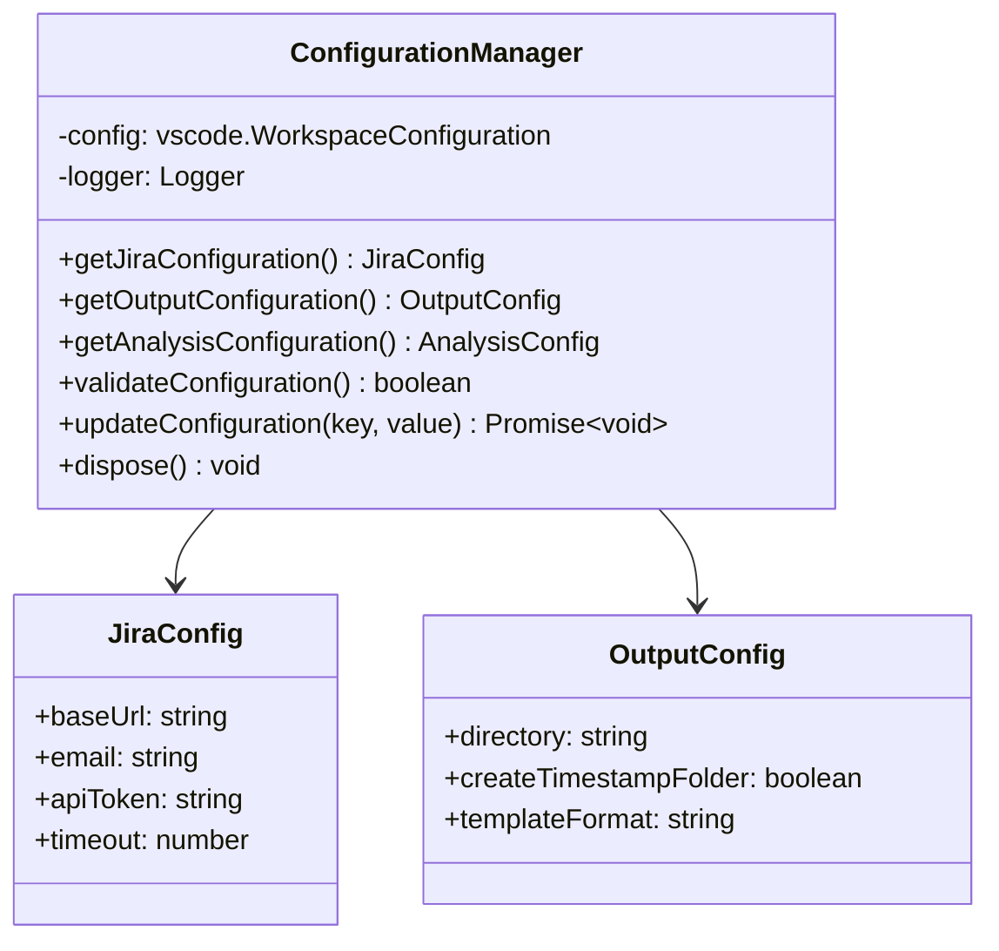
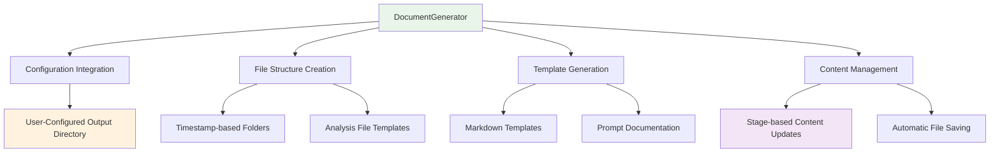
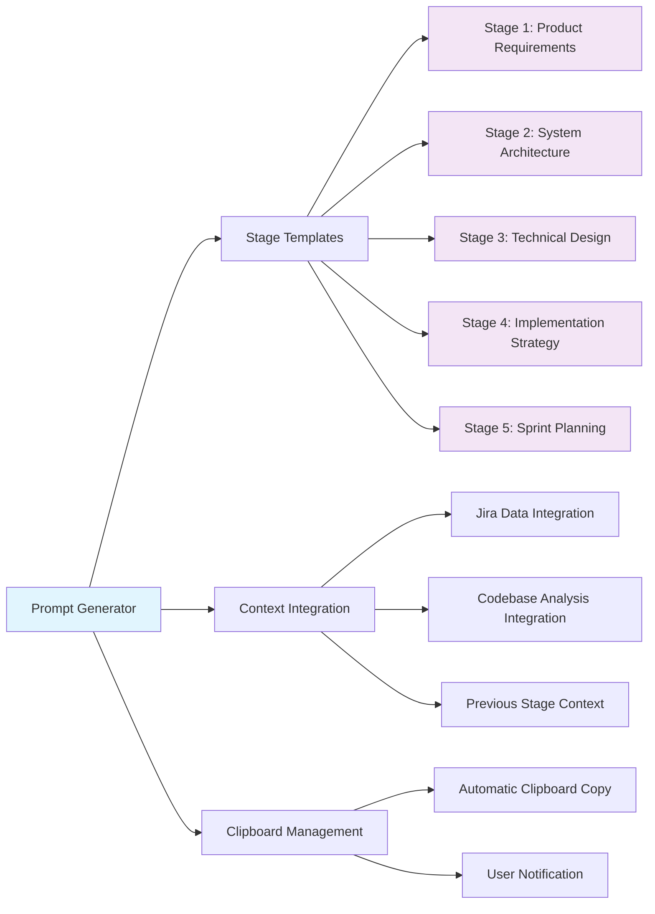
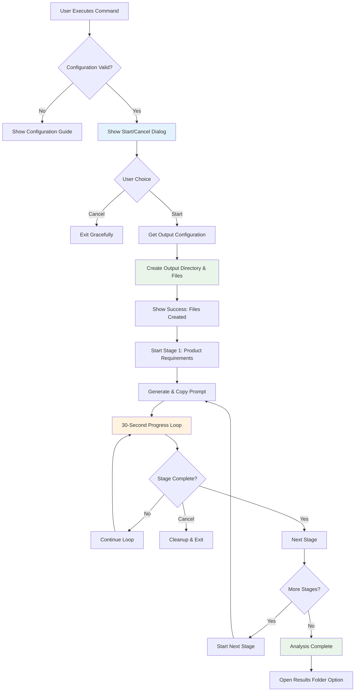
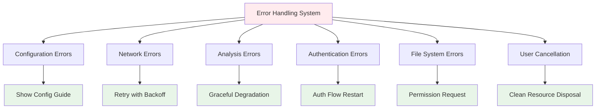
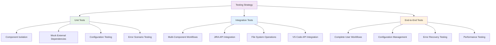
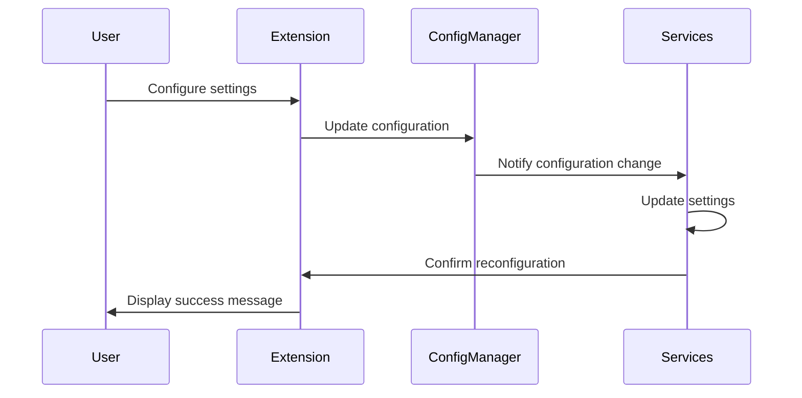

# AI Product Owner Agent - Technical Architecture

## Executive Summary

The AI Product Owner Agent is an enterprise-grade VS Code extension architected for scalable, automated technical analysis and documentation generation. Built on modern software engineering principles, the system employs a modular, event-driven architecture with comprehensive error handling, real-time progress tracking, and seamless integration with enterprise development ecosystems.

## System Architecture Overview



## Architectural Principles & Design Philosophy

## Detailed Component Sequence Flow



## Component Architecture Deep Dive

### MultiStageAnalysisEngine (Core Orchestrator)

**Purpose**: Central orchestration of the analysis workflow with state management and progress tracking.

**Key Responsibilities**:
- Analysis lifecycle management (start, progress, cancellation, completion)
- Stage coordination and data flow between analysis phases
- User interaction management (dialogs, progress updates)
- Error handling and recovery coordination

**Architecture Pattern**: Command Pattern with State Machine

```typescript
class MultiStageAnalysisEngine {
  private readonly stages: readonly AnalysisStage[];
  private readonly configManager: ConfigurationManager;
  private readonly jiraClient: JiraClient;
  private readonly codebaseAnalyzer: CodebaseAnalyzer;
  
  async executeAnalysis(epicKey: string): Promise<AnalysisResult> {
    // State validation and initialization
    // Progress tracking setup
    // Stage-by-stage execution with error handling
    // Result aggregation and document generation
  }
}
```

### ConfigurationManager (Settings & Security)

**Purpose**: Centralized configuration management with secure credential handling and VS Code settings integration.

**Security Features**:
- VS Code SecretStorage API for sensitive data
- Configuration validation and sanitization
- Environment-specific settings support
- Audit logging for configuration changes

**Configuration Schema**:
```typescript
interface ExtensionConfiguration {
  jira: {
    baseUrl: string;
    email: string;
    token: SecureString; // Stored in VS Code SecretStorage
    projectKeys: string[];
  };
  analysis: {
    timeoutMs: number;
    stages: AnalysisStageConfig[];
    outputDirectory: string;
  };
  ai: {
    provider: 'copilot' | 'custom';
    modelSettings: ModelConfiguration;
  };
}
```

### 1. Configuration-Driven Design
- **Centralized Configuration**: All settings managed through `ConfigurationManager`
- **User Preferences**: Workspace-specific and global user preferences
- **Dynamic Behavior**: Components adapt based on configuration
- **Validation**: Built-in configuration validation with sensible defaults

### 2. Staged Analysis Workflow
- **Sequential Processing**: 5-stage analysis with proper dependencies
- **Progress Tracking**: 30-second interval-based progress monitoring
- **User Control**: Start/cancel dialogs and manual progression
- **Automatic File Management**: Configuration-driven output directory creation

### 3. Resource Management
- **Proper Disposal**: All components implement dispose patterns
- **Memory Management**: Interval cleanup and resource deallocation
- **Error Recovery**: Comprehensive error handling with graceful degradation
- **Logging Integration**: Structured logging throughout the application

## Core Components

### 1. Configuration Manager (`ConfigurationManager.ts`)

**Purpose**: Centralized configuration management for the entire extension.



**Key Features**:
- Workspace-specific and global configuration support
- Runtime configuration validation
- Type-safe configuration access
- Default value management
- Configuration change notifications

### 2. Multi-Stage Analysis Engine (`MultiStageAnalysisEngine.ts`)

**Purpose**: Orchestrates the complete analysis workflow with proper UX integration.

```mermaid
sequenceDiagram
    participant User
    participant Engine as MultiStageAnalysisEngine
    participant Config as ConfigurationManager
    participant Doc as DocumentGenerator
    participant Prompt as PromptGenerator
    
    User->>Engine: Start Analysis
    Engine->>User: Show Start/Cancel Dialog
    User->>Engine: Confirm Start
    Engine->>Config: Get Output Configuration
    Config-->>Engine: Output Directory
    Engine->>Doc: Initialize File Structure
    Doc-->>Engine: Files Created
    
    loop For Each Stage (1-5)
        Engine->>Prompt: Generate Stage Prompt
        Prompt-->>Engine: Generated Prompt
        Engine->>Doc: Add Prompt to Documentation
        Engine->>User: Copy Prompt to Clipboard
        
        loop Every 30 Seconds
            Engine->>User: Stage Complete? Dialog
            alt Stage Complete
                User->>Engine: Yes, Complete
                break
            else Still Working
                User->>Engine: Continue
            else Cancel
                User->>Engine: Cancel Analysis
                Engine->>Engine: Cleanup & Exit
                break
            end
        end
    end
    
    Engine->>User: Analysis Complete Notification
```

**Key Features**:
- **Automated UX**: Start/cancel dialogs, progress tracking, file generation
- **ConfigurationManager Integration**: Uses centralized configuration
- **30-Second Intervals**: Promise-based interval checking with proper cleanup
- **Resource Management**: Proper disposal of intervals and resources
- **Error Handling**: Comprehensive error handling and user feedback

### 3. Document Generator (`DocumentGenerator.ts`)

**Purpose**: Automated creation and management of analysis output files and folder structure.



**Key Features**:
- **Configuration-Driven**: Uses `ConfigurationManager` for output directory
- **Automatic Structure Creation**: Creates folders and files on analysis start
- **Template System**: Professional markdown templates with proper formatting
- **Real-time Updates**: Updates files as analysis progresses
- **Path Resolution**: Handles both relative and absolute path configurations

### 4. Codebase Analyzer (`CodebaseAnalyzer.ts`)

**Purpose**: Comprehensive analysis of project codebases across multiple programming languages.

**Supported Languages**:
- JavaScript/TypeScript (Node.js, React, Vue, Angular)
- Python (Django, Flask, FastAPI)
- Java (Spring Boot, Maven, Gradle)
- C# (.NET, ASP.NET Core)
- Go (Gin, Echo, standard library)
- Rust (Cargo, Actix, Rocket)
- PHP (Laravel, Symfony, Composer)
- Ruby (Rails, Sinatra, Bundler)

**Analysis Capabilities**:
- **Pattern Recognition**: Framework and architecture pattern detection
- **Dependency Analysis**: Package and module dependency mapping
- **File Structure Analysis**: Project organization and structure insights
- **Technology Stack Detection**: Automatic identification of tools and frameworks
- **Complexity Assessment**: Code complexity and maintainability metrics

### 5. Prompt Generator (`PromptGenerator.ts`)

**Purpose**: Creates intelligent, context-rich prompts for GitHub Copilot integration.



**Prompt Engineering Features**:
- **Context-Rich Prompts**: Includes full codebase and JIRA context
- **Progressive Analysis**: Each stage builds on previous stage results
- **Role-Based Templates**: Different personas for each analysis stage
- **Clipboard Integration**: Automatic copying with user notifications
- **Quality Standards**: Principal Engineer-level analysis instructions

### 6. JIRA Client (`JiraClient.ts`)

**Purpose**: Secure integration with JIRA for epic and portfolio data retrieval.

**Integration Features**:
- **Secure Authentication**: API token-based authentication with secure storage
- **Epic Data Retrieval**: Comprehensive epic information fetching
- **Portfolio Analysis**: Multi-epic and project-level analysis support
- **Rate Limiting**: Respects JIRA API rate limits
- **Error Handling**: Robust error handling with retry mechanisms
- **Data Validation**: Validates and sanitizes JIRA responses

### 7. Logger & Error Handler (`Logger.ts`, `ErrorHandler.ts`)

**Purpose**: Comprehensive logging and error management system.

**Logging Features**:
- **Structured Logging**: JSON-based log format with context
- **Multiple Log Levels**: Debug, Info, Warning, Error with filtering
- **Component-Specific Loggers**: Per-component logging with proper categorization
- **Performance Monitoring**: Operation timing and performance metrics
- **Output Channel Integration**: Real-time logging to VS Code output channels

**Error Handling Features**:
- **Contextual Error Information**: Rich error context for debugging
- **User-Friendly Messages**: Translated technical errors to user-friendly messages  
- **Error Recovery**: Automatic retry mechanisms with exponential backoff
- **Error Reporting**: Structured error reporting with stack traces
- **Graceful Degradation**: Continues operation when possible after errors

## Automated User Experience Flow

### Complete Analysis Workflow



### Stage Execution Detail

```mermaid
sequenceDiagram
    participant User
    participant Engine
    participant Prompt
    participant Clipboard
    participant Copilot as GitHub Copilot
    
    Engine->>Prompt: Generate Stage Prompt
    Prompt-->>Engine: Context-Rich Prompt
    Engine->>Clipboard: Copy Prompt
    Engine->>User: Notification: Prompt Copied
    
    User->>Copilot: Paste Prompt in Chat
    Copilot-->>User: Generate Analysis Response
    
    loop Every 30 Seconds
        Engine->>User: Stage Complete Dialog
        alt Still Working
            User-->>Engine: Continue
        else Stage Complete  
            User-->>Engine: Mark Complete
            break
        else Cancel
            User-->>Engine: Cancel Analysis
            Engine->>Engine: Cleanup Resources
            break
        end
    end
```

## Integration Points

### GitHub Copilot Integration (Manual Workflow)

The extension provides a streamlined manual workflow with GitHub Copilot:

**Prompt Generation**:
- Context-rich prompts with full codebase analysis
- Role-based prompt templates (Product Manager, Principal Engineer, etc.)
- Progressive analysis where each stage builds on previous results
- Automatic clipboard integration for seamless workflow

**User Workflow**:
1. Extension generates prompt and copies to clipboard
2. User pastes prompt into GitHub Copilot Chat
3. User reviews Copilot's analysis response
4. User marks stage as complete when satisfied
5. Process repeats for all 5 stages

**Context Preservation**:
- Each prompt includes results from previous stages
- Full codebase context maintained throughout workflow
- JIRA epic information integrated into all prompts
- Consistent analysis quality through structured templates

### JIRA Integration

Comprehensive JIRA integration for project context:

**Authentication & Security**:
- API token-based authentication
- Secure credential storage in VS Code secrets
- Configurable timeout and retry settings
- Rate limiting compliance

**Data Retrieval**:
- Epic information and story details
- Portfolio and project-level data
- User story analysis and breakdown
- Priority and timeline information

**Error Handling**:
- Network failure recovery
- Authentication error guidance  
- Rate limit handling with user feedback
- Invalid epic key validation

## Performance & Scalability

### Optimization Strategies

1. **Lazy Loading**: Components initialized on-demand
2. **Caching**: Analysis results cached to avoid redundant processing
3. **Incremental Analysis**: Only analyze changed files when possible  
4. **Background Processing**: Long operations don't block UI
5. **Resource Management**: Proper disposal of all resources
6. **Memory Optimization**: Efficient memory usage for large codebases

### Scalability Considerations

- **Large Codebases**: Handles repositories with thousands of files
- **Rate Limiting**: Respects external API limits (JIRA)
- **Progress Reporting**: Real-time feedback for long operations
- **Cancellation Support**: User can cancel long-running operations
- **Configuration Flexibility**: Adaptable to different project sizes

## Security & Privacy

### Data Protection

- **Local Processing**: All code analysis remains on local machine
- **Secure Communication**: HTTPS/TLS for all external API calls
- **Token Management**: Secure storage of authentication credentials
- **Permission Model**: Respects VS Code's security permissions
- **Data Sanitization**: All external data properly validated

### Privacy Considerations

- **Local Analysis**: No code automatically sent to external services
- **User Control**: Manual workflow gives users complete control
- **Temporary Data**: Proper cleanup of temporary data and caches
- **Configuration Security**: Sensitive settings encrypted in storage
- **Audit Trail**: Comprehensive logging for security auditing

## Error Handling & Recovery

### Error Categories & Responses



### Recovery Mechanisms

- **Automatic Retry**: Transient failures retried with exponential backoff
- **Graceful Degradation**: Partial functionality when services unavailable
- **User Guidance**: Clear error messages with actionable resolution steps  
- **State Recovery**: Analysis can resume from last completed stage
- **Resource Cleanup**: Proper cleanup even during error conditions

## Testing Strategy

### Test Architecture



### Coverage Requirements

- **Unit Tests**: 85%+ coverage for core business logic
- **Integration Tests**: All external integrations tested with mocks
- **Error Scenarios**: 100% coverage of error handling paths
- **Configuration Tests**: All configuration combinations tested
- **Regression Tests**: Prevent UX regressions from code changes

## Deployment & Distribution

### Extension Distribution

- **VS Code Marketplace**: Primary distribution channel
- **VSIX Packaging**: Local installation and testing support
- **Version Management**: Semantic versioning with comprehensive changelogs
- **Compatibility Matrix**: VS Code version compatibility tracking

### Configuration Management

- **Workspace Settings**: Project-specific configurations
- **User Preferences**: Global user settings and defaults
- **Environment Variables**: Runtime configuration overrides
- **Migration Support**: Automatic settings migration between versions
- **Validation**: Runtime configuration validation with user feedback

---

*This architecture document reflects the current implementation as of 2025. For usage instructions, see [USER_GUIDE.md](USER_GUIDE.md). For development information, see [DEVELOPER_GUIDE.md](DEVELOPER_GUIDE.md).*
- Coordinates between different components
- Manages extension lifecycle
- Handles command registration and execution
- **Key Commands:**
  - `aiProductOwner.analyzeCodebase`: Initiates codebase analysis
  - `aiProductOwner.pasteCopilotResponse`: Processes Copilot responses

### 3. Multi-Stage Analysis Engine (`MultiStageAnalysisEngine.ts`)
- Orchestrates the complete analysis workflow
- Manages different analysis phases:
  - Initial codebase scanning
  - Pattern recognition
  - Prompt generation for Copilot
  - Response processing
  - Documentation generation
- Coordinates with external services

### 4. Codebase Analyzer (`CodebaseAnalyzer.ts`)
- Performs static code analysis
- Identifies code patterns and structures
- Extracts meaningful insights from source code
- Supports multiple programming languages
- Generates analysis reports for prompt creation

### 5. Prompt Generator (`PromptGenerator.ts`)
- Creates intelligent prompts for GitHub Copilot
- Contextualizes requests based on codebase analysis
- Manages prompt templates and variations
- Copies prompts to clipboard for manual pasting into Copilot
- Processes responses pasted back from Copilot

### 6. Document Generator (`DocumentGenerator.ts`)
- Converts analysis results into structured documents
- Supports multiple output formats (Markdown, HTML)
- Template-based document generation
- Handles document formatting and styling
- Integrates Copilot responses into final documentation

### 7. JIRA Client (`JiraClient.ts`)
- Manages JIRA API integration
- Fetches epic and story information
- Handles authentication and authorization
- Provides structured data access for project context

## Data Flow

### Manual Analysis Workflow

1. **Initialization**
   - Extension activates on command execution
   - Configuration Manager loads settings
   - Services are initialized

2. **Codebase Analysis**
   - Codebase Analyzer scans target directory
   - File patterns are identified and categorized
   - Code structure and dependencies are mapped

3. **Prompt Generation**
   - Analysis results feed into Prompt Generator
   - Intelligent prompts are created with codebase context
   - Prompts are copied to clipboard automatically

4. **Manual Copilot Integration**
   - User pastes prompt into GitHub Copilot Chat
   - User reviews Copilot's response
   - User copies Copilot response back to clipboard
   - User executes `pasteCopilotResponse` command

5. **Response Processing**
   - Extension processes Copilot response from clipboard
   - Response is integrated with analysis data

6. **External Data Integration**
   - JIRA Client fetches relevant project information
   - External context is merged with analysis results

7. **Document Generation**
   - Document Generator processes all collected data
   - Structured documents are created using templates
   - Output includes both analysis and Copilot insights

### Configuration Flow



## Integration Points

### GitHub Copilot Integration (Manual)

The extension works with GitHub Copilot through a manual workflow:

- **Prompt Generation**: Creates structured prompts with codebase context
- **Clipboard Integration**: Automatically copies prompts to clipboard
- **User-Mediated**: User manually pastes into Copilot Chat
- **Response Handling**: Processes responses pasted back by user
- **Context Preservation**: Maintains analysis context throughout workflow

### JIRA Integration

JIRA integration provides project context:

- **Epic Fetching**: Retrieves epic information for context
- **Story Analysis**: Analyzes user stories and requirements
- **Status Tracking**: Monitors project progress
- **Authentication**: Supports both basic auth and OAuth

## Extension Points

### Language Support

The analyzer supports multiple programming languages:
- JavaScript/TypeScript
- Python
- Java
- C#
- Go
- Rust
- PHP
- Ruby
- Generic analysis for other languages

### Template System

Document generation uses a flexible template system:
- Customizable templates for different document types
- Support for multiple output formats
- Template inheritance and composition
- Dynamic content injection

## Performance Considerations

### Optimization Strategies

1. **Lazy Loading**: Components are loaded on-demand
2. **Caching**: Analysis results are cached to avoid redundant processing
3. **Incremental Analysis**: Changed files trigger partial re-analysis
4. **Background Processing**: Long-running tasks execute in background
5. **Resource Management**: Memory usage is monitored and optimized

### Scalability

- **Large Codebases**: Handles large repositories through batched processing
- **Rate Limiting**: Respects API rate limits for JIRA service
- **Progress Reporting**: Provides user feedback during long operations
- **Manual Workflow**: No API rate limits for Copilot integration

## Security

### Data Protection

- **Local Processing**: All code analysis remains on local machine
- **Secure Communication**: JIRA API calls use HTTPS/TLS
- **Token Management**: Secure storage of JIRA authentication tokens
- **Permission Model**: Respects VS Code's permission system
- **Clipboard Security**: Temporary clipboard usage for prompt/response transfer

### Privacy

- **Local Analysis**: No code sent to external services automatically
- **User Control**: Manual workflow gives user full control over data sharing
- **Local Storage**: Configuration and cache stored locally
- **Clean Disposal**: Temporary data is properly cleaned up

## Error Handling

### Error Categories

1. **Configuration Errors**: Invalid settings or missing requirements
2. **Network Errors**: JIRA API communication failures
3. **Analysis Errors**: Code parsing or analysis failures
4. **Authentication Errors**: JIRA authentication issues
5. **File System Errors**: File access or permission issues
6. **Clipboard Errors**: Clipboard access or formatting issues

### Recovery Mechanisms

- **Automatic Retry**: Transient failures are retried with backoff
- **Graceful Degradation**: Partial functionality when services unavailable
- **User Notification**: Clear error messages and resolution steps
- **Comprehensive Logging**: Detailed logging for troubleshooting

## Testing Strategy

### Unit Testing

- **Component Isolation**: Each component tested independently
- **Mock Services**: External dependencies mocked for testing
- **Coverage Requirements**: Comprehensive test coverage
- **Automated Testing**: Tests run on every build

### Integration Testing

- **End-to-End Workflows**: Complete user scenarios tested
- **Service Integration**: JIRA API interactions validated
- **Manual Workflow Testing**: Clipboard and command integration tested
- **Error Scenarios**: Failure modes explicitly tested

## Deployment

### Extension Distribution

- **VS Code Marketplace**: Primary distribution channel
- **VSIX Packaging**: Local installation support
- **Version Management**: Semantic versioning and release notes
- **Compatibility**: VS Code version compatibility matrix

### Configuration Management

- **Workspace Settings**: Project-specific configurations
- **User Settings**: Global user preferences
- **Environment Variables**: Runtime configuration overrides
- **Migration Support**: Settings migration between versions

---

*For detailed usage instructions, see [USER_GUIDE.md](USER_GUIDE.md). For development information, see [DEVELOPER_GUIDE.md](DEVELOPER_GUIDE.md).*