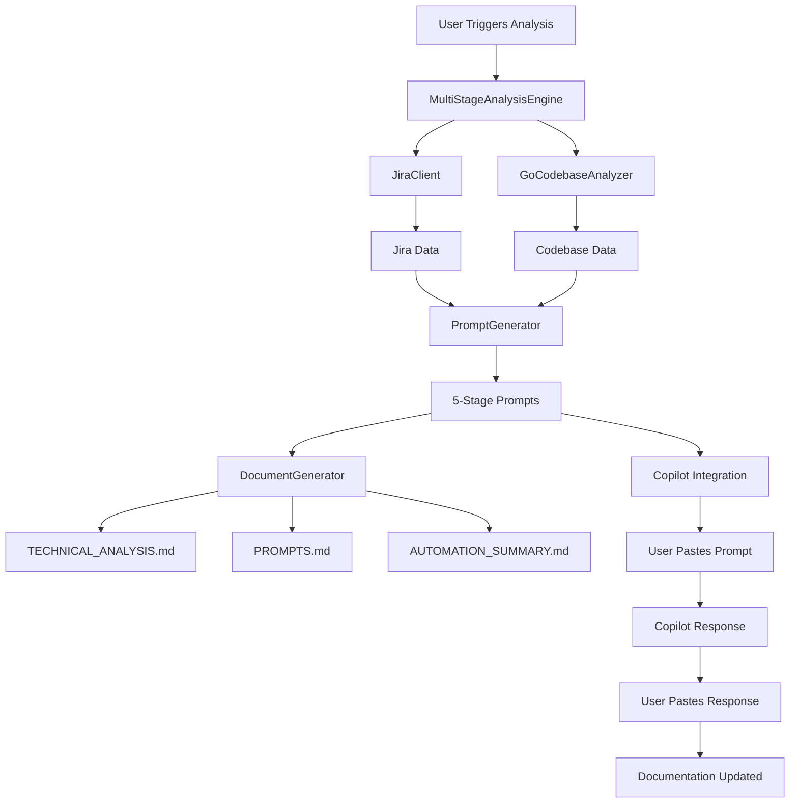
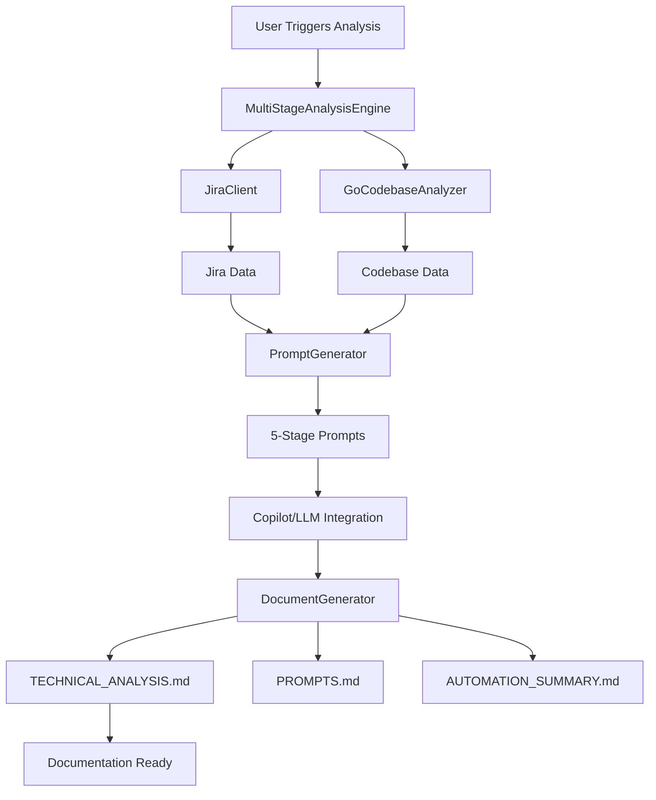
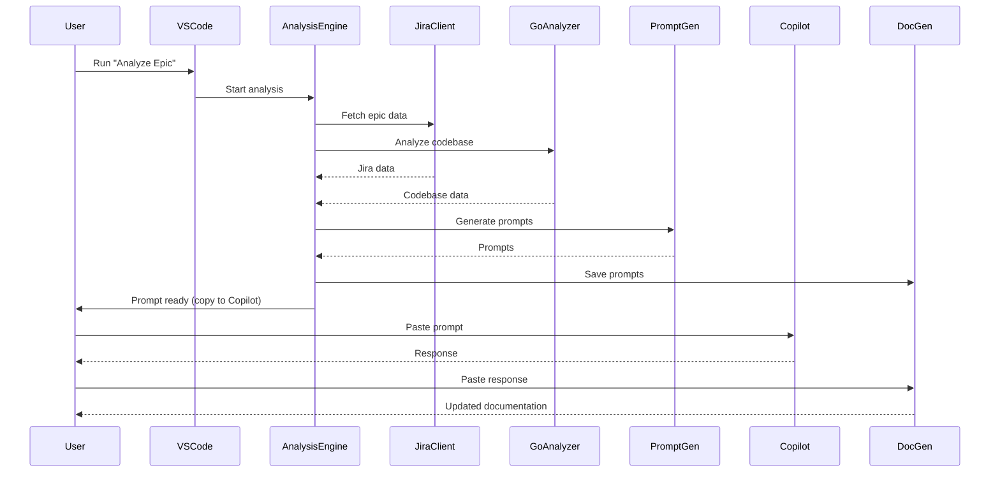
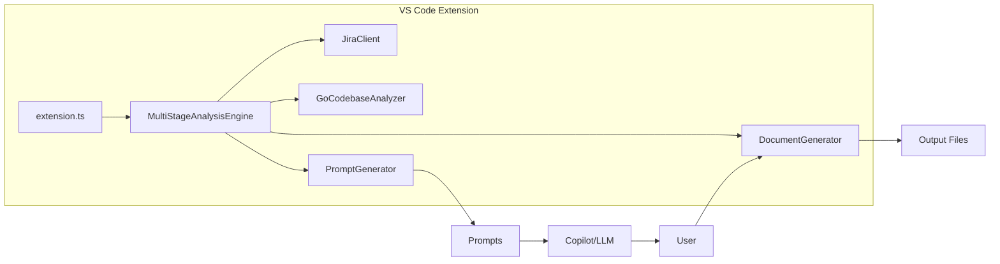

# AI Product Owner Agent - Architecture Overview

---

## High-Level Workflow (Current)

---

## High-Level Workflow (Future Vision)

---

## Component Overview
- **extension.ts**: Entry point, command registration, and user interaction
- **MultiStageAnalysisEngine**: Orchestrates the workflow, manages progress, coordinates all components
- **JiraClient**: Fetches and parses Jira epic/portfolio data
- **GoCodebaseAnalyzer**: Analyzes Go project structure, patterns, and complexity
- **PromptGenerator**: Creates context-rich, multi-stage prompts using best practices
- **DocumentGenerator**: Manages output files and documentation
- **Copilot/LLM Integration**: Executes prompts and generates technical analysis (manual now, automated in future)

---

## Sequence Diagram: End-to-End Analysis (Current)

---

## Roles & Responsibilities
- **User**: Triggers analysis, pastes prompts into Copilot/LLM, pastes responses into documentation (current), reviews and validates output
- **Extension**: Automates data collection, prompt generation, and documentation management
- **Copilot/LLM**: Provides technical analysis and recommendations

---

## Visual: Component Interactions

---

## Prompt Engineering Best Practices
- Context-rich, multi-step prompts
- Explicit role and task instructions
- Use of XML/structured tags and thinking steps
- Sequential, progressive analysis (each stage builds on previous)
- Visual requirements (Mermaid diagrams)
- Principal Engineer-level technical depth

---

## Output Artifacts
- `TECHNICAL_ANALYSIS.md`: Main analysis doc
- `PROMPTS.md`: All generated prompts
- `AUTOMATION_SUMMARY.md`: Workflow summary
- **Jira-Ready Task Breakdown**
- **Mermaid Diagrams** for architecture, flows, and dependencies
- **Decision Log & Risk Assessment**

---

*For user and developer instructions, see [USER_GUIDE.md](USER_GUIDE.md) and [DEVELOPER_GUIDE.md](DEVELOPER_GUIDE.md).* 