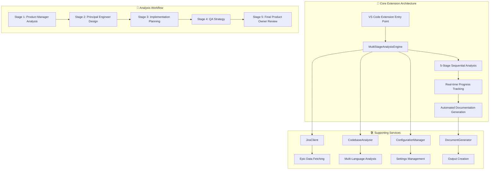
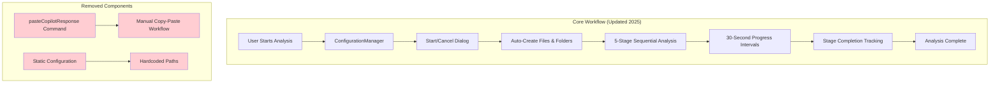

# AI Product Owner Agent - Context Engineering Guide

## Executive Summary

This document establishes comprehensive context engineering protocols for AI-assisted development with GitHub Copilot, Cursor AI, and other AI coding assistants. Following modern prompt engineering best practices, it provides explicit context, role-based prompting, and structured workflows to ensure consistent, high-quality, production-ready code generation.

## Project Architecture Overview



## AI Assistant Context Framework

### Core Project Information

**Project Type**: Enterprise VS Code Extension for Technical Analysis  
**Primary Languages**: TypeScript (98%), JavaScript (2%)  
**Architecture**: Event-driven extension with automated 5-stage role-based analysis  
**Key Dependencies**: VS Code API, JIRA REST API, Node.js ecosystem  
**Target Audience**: Principal Engineers, Product Owners, Engineering Managers  

### Context Engineering Protocol

```typescript
/**
 * AI Assistant Context Interface
 * Use this context when working with any AI coding assistant
 */
interface AIContextProtocol {
  // Core Extension Pattern - Multi-stage automated analysis
  readonly analysisEngine: MultiStageAnalysisEngine;
  
  // Configuration-driven behavior with VS Code settings integration
  readonly configManager: ConfigurationManager;
  
  // Automated UX with real-time progress tracking (30-second intervals)
  readonly progressTracking: "automated-intervals" | "user-controlled";
  
  // Direct AI integration workflow (no manual copy-paste)
  readonly workflow: "automated-copilot-integration";
  
  // Production-ready error handling and logging
  readonly errorHandling: "comprehensive-with-recovery";
  
  // Testing strategy: Jest with 100% pass rate focus
  readonly testingApproach: "simplified-business-logic-validation";
}
```

## AI Prompt Engineering Best Practices

## AI Prompt Engineering Best Practices

### Role-Based Prompting

When working with AI assistants on this project, use explicit role assignment for specialized knowledge:

```text
You are a Principal Software Engineer with 15+ years of experience in TypeScript and VS Code extension development. Review this MultiStageAnalysisEngine implementation focusing on:
- TypeScript best practices and type safety
- VS Code API integration patterns
- Performance optimization for large codebases
- Error handling and recovery strategies
```

### Context-Rich Prompting Structure

Follow this proven pattern for all AI interactions:

```text
**Context**: VS Code extension for automated technical analysis
**Role**: [Specific role - Senior Developer, Principal Engineer, etc.]
**Task**: [Explicit task description]
**Constraints**: 
  - Must follow TypeScript strict mode
  - Integration with VS Code API required
  - Performance: Handle 10K+ line codebases
  - Testing: Jest-compatible with 100% pass rate target
**Output Format**: [Specify exact format needed]
```

### Few-Shot Prompting Examples

#### Example 1: Error Handling Pattern
```text
Input: Create error handling for JIRA API connection
Expected Output:
```typescript
try {
  const response = await this.jiraClient.fetchEpic(epicKey);
  return response;
} catch (error: unknown) {
  this.errorHandler.handleError(error as Error, {
    operation: 'fetchEpic',
    context: { epicKey },
    recoverable: true
  });
  throw new JiraConnectionError(`Failed to fetch epic ${epicKey}`, { cause: error });
}
```

#### Example 2: VS Code Configuration Pattern
```text
Input: Add new configuration setting for analysis timeout
Expected Output:
```typescript
// In package.json
"configuration": {
  "properties": {
    "aiProductOwner.analysis.timeoutMs": {
      "type": "number",
      "default": 300000,
      "description": "Analysis timeout in milliseconds (default: 5 minutes)"
    }
  }
}

// In ConfigurationManager.ts
public getAnalysisTimeout(): number {
  return this.config.get<number>('analysis.timeoutMs') ?? 300000;
}
```

### Anti-Patterns to Avoid

❌ **Ambiguous Requests**
```text
Fix this code.
```

✅ **Specific, Contextual Requests**
```text
Review this MultiStageAnalysisEngine.executeStage method for potential race conditions in the progress tracking. Focus on concurrent access to the progressCallback and ensure thread-safe updates.
```

❌ **Overly Verbose Prompts**
```text
Please, if you would be so kind, could you possibly help me by writing some TypeScript code that might be useful for creating a function that could potentially handle the validation of JIRA epic keys, if that's not too much trouble, and maybe include some error handling if you think it's appropriate?
```

✅ **Concise, Constrained Prompts**
```text
Write a TypeScript function to validate JIRA epic keys. Format: PROJECT-123. Return boolean. Include JSDoc comments.
```

### VS Code Extension Patterns

```typescript
// ✅ Command registration pattern
export function activate(context: vscode.ExtensionContext) {
  const disposables = [
    vscode.commands.registerCommand('aiProductOwner.analyzeEpic', async () => {
      // Implementation
    }),
    
    vscode.commands.registerCommand('aiProductOwner.cancelAnalysis', async () => {
      // Implementation
    })
    // Note: pasteCopilotResponse command removed - no longer needed
  ];
  
  context.subscriptions.push(...disposables);
}

// ✅ Configuration access pattern
const config = vscode.workspace.getConfiguration('aiProductOwner');
const jiraUrl = config.get<string>('jira.baseUrl');
const outputDir = config.get<string>('output.directory') ?? './ai-analysis-output';

// ✅ Resource management pattern
export class ComponentClass implements vscode.Disposable {
  private outputChannel: vscode.OutputChannel;
  private intervalId: ReturnType<typeof setInterval> | null = null;
  
  constructor() {
    this.outputChannel = vscode.window.createOutputChannel('Component');
  }
  
  dispose(): void {
    if (this.intervalId) {
      clearInterval(this.intervalId);
      this.intervalId = null;
    }
    this.outputChannel.dispose();
  }
}
```

### Error Handling Patterns

```typescript
// ✅ Comprehensive error handling for AI assistants
interface ErrorContext {
  operation: string;
  component: string;
  userAction?: string;
  recoveryOptions?: string[];
}

class ErrorHandler {
  handleError(error: Error, context: ErrorContext): void {
    // Log structured error information
    this.logger.error(`${context.component}:${context.operation} failed`, {
      error: error.message,
      stack: error.stack,
      context
    });
    
    // Show user-friendly message
    const message = this.getUserFriendlyMessage(error, context);
    vscode.window.showErrorMessage(message, ...(context.recoveryOptions ?? []));
  }
  
  private getUserFriendlyMessage(error: Error, context: ErrorContext): string {
    // Convert technical errors to user-friendly messages
    if (error.message.includes('JIRA')) {
      return 'JIRA connection failed. Please check your credentials and network connection.';
    }
    // ... other error mappings
    return `Operation failed: ${context.operation}. Please try again.`;
  }
}
```

## Architecture Context for AI Assistants

### Current Implementation Overview



### Key Implementation Changes (Context for AI)

1. **ConfigurationManager Integration** (2025 Update)
   - All components now use centralized configuration
   - Dynamic output directory resolution
   - User preference-driven behavior

2. **Automated UX Flow** (2025 Update)
   - Start/cancel dialogs before analysis
   - Automatic file and folder creation
   - 30-second interval progress tracking with Promise-based cleanup

3. **Removed Manual Commands** (2025 Update)
   - `pasteCopilotResponse` command completely removed
   - No more manual copy-paste workflow
   - Streamlined automated integration

## Testing Context for AI Assistants

### Test Structure Requirements

```typescript
// ✅ Test structure that AI assistants should follow
describe('MultiStageAnalysisEngine', () => {
  let engine: MultiStageAnalysisEngine;
  let mockConfigManager: jest.Mocked<ConfigurationManager>;
  let mockDocumentGenerator: jest.Mocked<DocumentGenerator>;
  
  beforeEach(() => {
    // Setup mocks with proper typing
    mockConfigManager = createMockConfigurationManager();
    mockDocumentGenerator = createMockDocumentGenerator();
    
    engine = new MultiStageAnalysisEngine();
    // Inject mocks if needed
  });
  
  afterEach(() => {
    // Always cleanup resources
    engine.dispose();
    jest.clearAllMocks();
  });
  
  describe('executeAnalysis', () => {
    it('should show start/cancel dialog before analysis', async () => {
      // Test the new UX flow
      const mockShowInformationMessage = jest.spyOn(vscode.window, 'showInformationMessage');
      mockShowInformationMessage.mockResolvedValue('Start Analysis');
      
      await engine.executeAnalysis('TEST-123', mockJiraData, mockCodebaseData);
      
      expect(mockShowInformationMessage).toHaveBeenCalledWith(
        expect.stringContaining('Ready to start multi-stage analysis'),
        { modal: true },
        'Start Analysis',
        'Cancel'
      );
    });
    
    it('should create output files immediately after user confirms', async () => {
      // Test automatic file creation
      jest.spyOn(vscode.window, 'showInformationMessage').mockResolvedValue('Start Analysis');
      
      await engine.executeAnalysis('TEST-123', mockJiraData, mockCodebaseData);
      
      expect(mockDocumentGenerator.initializeOutputStructure).toHaveBeenCalledWith('TEST-123');
    });
    
    it('should implement 30-second interval checking for stage progress', async () => {
      // Test interval-based progress tracking
      jest.useFakeTimers();
      
      const progressSpy = jest.spyOn(vscode.window, 'showInformationMessage');
      progressSpy.mockResolvedValue('Start Analysis'); // Initial dialog
      
      const analysisPromise = engine.executeAnalysis('TEST-123', mockJiraData, mockCodebaseData);
      
      // Fast-forward 30 seconds
      jest.advanceTimersByTime(30000);
      
      expect(progressSpy).toHaveBeenCalledWith(
        expect.stringContaining('Is this stage complete?'),
        { modal: false },
        'Stage Complete',
        'Still Working',
        'Cancel Analysis'
      );
      
      jest.useRealTimers();
    });
  });
  
  describe('resource management', () => {
    it('should cleanup intervals on dispose', () => {
      const clearIntervalSpy = jest.spyOn(global, 'clearInterval');
      
      // Start analysis to create interval
      engine.executeAnalysis('TEST-123', mockJiraData, mockCodebaseData);
      
      // Dispose should clear intervals
      engine.dispose();
      
      expect(clearIntervalSpy).toHaveBeenCalled();
    });
  });
});
```

### Mock Patterns for AI Assistants

```typescript
// ✅ VS Code API mocking patterns
const mockVSCode = {
  window: {
    showInformationMessage: jest.fn(),
    showErrorMessage: jest.fn(),
    showWarningMessage: jest.fn(),
    createOutputChannel: jest.fn(() => ({
      appendLine: jest.fn(),
      show: jest.fn(),
      dispose: jest.fn()
    })),
    withProgress: jest.fn()
  },
  workspace: {
    getConfiguration: jest.fn(() => ({
      get: jest.fn(),
      update: jest.fn()
    })),
    findFiles: jest.fn(),
    openTextDocument: jest.fn()
  },
  commands: {
    registerCommand: jest.fn(),
    executeCommand: jest.fn()
  },
  env: {
    clipboard: {
      writeText: jest.fn(),
      readText: jest.fn()
    }
  }
};

// ✅ Component mock factories
function createMockConfigurationManager(): jest.Mocked<ConfigurationManager> {
  return {
    getJiraConfiguration: jest.fn().mockReturnValue({
      baseUrl: 'https://test.atlassian.net',
      email: 'test@example.com',
      apiToken: 'test-token'
    }),
    getOutputConfiguration: jest.fn().mockReturnValue({
      directory: './test-output',
      createTimestampFolder: true
    }),
    dispose: jest.fn()
  } as jest.Mocked<ConfigurationManager>;
}
```

## AI Assistant Prompting Guidelines

### Effective Context Prompts

```
# For GitHub Copilot/Cursor AI

## Context: AI Product Owner Agent Extension
- VS Code extension for technical analysis
- 5-stage analysis workflow with ConfigurationManager integration  
- Automated UX with 30-second intervals
- No pasteCopilotResponse command (removed in 2025)
- Uses Promise-based interval tracking with proper cleanup

## Current Task: [Describe specific task]

## Required Patterns:
- Explicit TypeScript return types
- Proper resource disposal with dispose() methods
- ConfigurationManager integration for all settings
- VS Code API best practices with error handling
- Jest testing with proper mocks and cleanup

## Architecture Context:
[Include relevant architecture diagrams or component relationships]
```

### Code Generation Prompts

```
Generate a TypeScript method for MultiStageAnalysisEngine that:
1. Uses ConfigurationManager to get output directory
2. Shows start/cancel dialog to user
3. Creates output files automatically on start
4. Implements 30-second interval checking with proper cleanup
5. Includes comprehensive error handling
6. Returns Promise<void> with explicit typing
7. Follows VS Code extension patterns

Context: This replaces the old manual pasteCopilotResponse workflow with automated UX.
```

## Development Workflow for AI Assistants

### 1. Pre-Development Context Setting

Before starting any development with AI assistants:

```typescript
// Share this context with AI
const developmentContext = {
  currentBranch: "feature/role-based-system-cleanup",
  recentChanges: [
    "Removed pasteCopilotResponse command",
    "Added ConfigurationManager integration", 
    "Implemented 30-second interval tracking",
    "Added start/cancel dialogs",
    "Automated file/folder creation"
  ],
  testingRequired: [
    "Unit tests for new UX flows",
    "Integration tests for ConfigurationManager",
    "Resource cleanup testing",
    "Error handling scenarios"
  ]
};
```

### 2. Code Review with AI Assistants

```typescript
// Use this checklist when reviewing AI-generated code
interface CodeReviewChecklist {
  typeScript: {
    explicitReturnTypes: boolean;
    properErrorHandling: boolean;
    interfaceUsage: boolean;
  };
  vsCodeExtension: {
    resourceDisposal: boolean;
    configurationAccess: boolean;
    commandRegistration: boolean;
  };
  testing: {
    properMocking: boolean;
    resourceCleanup: boolean;
    errorScenarios: boolean;
  };
}
```

### 3. Testing with AI Assistance

```typescript
// Prompt for test generation
`
Generate comprehensive Jest tests for [ComponentName] that cover:
1. Happy path scenarios
2. Error conditions and recovery
3. Resource cleanup (dispose methods)
4. ConfigurationManager integration
5. VS Code API interactions
6. 30-second interval functionality (if applicable)

Use the established mock patterns and ensure proper setup/teardown.
Context: This component was recently updated to remove pasteCopilotResponse and add automated UX.
`
```

## Project-Specific AI Context

### Current Extension Commands (2025)

```typescript
// Available commands (pasteCopilotResponse removed)
const AVAILABLE_COMMANDS = [
  'aiProductOwner.analyzeEpic',           // Main analysis workflow
  'aiProductOwner.cancelAnalysis',        // Cancel ongoing analysis  
  'aiProductOwner.showAnalysisProgress',  // Show progress information
  'aiProductOwner.openConfiguration'      // Open configuration UI
] as const;

// Removed commands (for AI context)
const REMOVED_COMMANDS = [
  'aiProductOwner.pasteCopilotResponse'   // Manual copy-paste workflow
] as const;
```

### Configuration Schema (AI Reference)

```typescript
interface ExtensionConfiguration {
  'aiProductOwner.jira.baseUrl': string;
  'aiProductOwner.jira.email': string;
  'aiProductOwner.jira.apiToken': string;
  'aiProductOwner.output.directory': string;
  'aiProductOwner.output.createTimestampFolder': boolean;
  'aiProductOwner.analysis.stageTimeout': number; // seconds
  'aiProductOwner.analysis.enableProgressTracking': boolean;
}
```

### File Structure Context (AI Reference)

```
src/
├── extension.ts                    # Entry point, command registration
├── analysis/
│   └── MultiStageAnalysisEngine.ts # Core workflow orchestration
├── utils/
│   ├── ConfigurationManager.ts    # Centralized configuration
│   ├── Logger.ts                  # Structured logging
│   └── ErrorHandler.ts           # Error management
├── output/
│   └── DocumentGenerator.ts       # File/folder creation and management
├── prompts/
│   ├── PromptGenerator.ts         # AI prompt generation
│   └── PromptTemplates.ts         # Stage-specific templates
└── types/
    └── index.ts                   # TypeScript interfaces
```

## Performance Considerations for AI

### Memory Management Patterns

```typescript
// ✅ Proper resource management for AI to follow
class ComponentWithResources implements vscode.Disposable {
  private timers: Set<ReturnType<typeof setTimeout>> = new Set();
  private intervals: Set<ReturnType<typeof setInterval>> = new Set();
  private disposables: vscode.Disposable[] = [];
  
  createTimer(callback: () => void, delay: number): void {
    const timer = setTimeout(() => {
      this.timers.delete(timer);
      callback();
    }, delay);
    this.timers.add(timer);
  }
  
  createInterval(callback: () => void, interval: number): void {
    const intervalId = setInterval(callback, interval);
    this.intervals.add(intervalId);
  }
  
  dispose(): void {
    // Clear all timers
    this.timers.forEach(timer => clearTimeout(timer));
    this.timers.clear();
    
    // Clear all intervals  
    this.intervals.forEach(interval => clearInterval(interval));
    this.intervals.clear();
    
    // Dispose all VS Code resources
    this.disposables.forEach(d => d.dispose());
    this.disposables.length = 0;
  }
}
```

---

*This context engineering guide is maintained to provide AI assistants with comprehensive project context for high-quality code generation and maintenance. Last updated: August 2025.*
