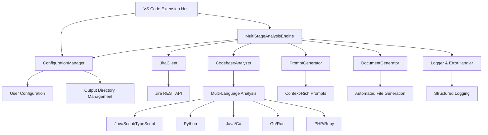
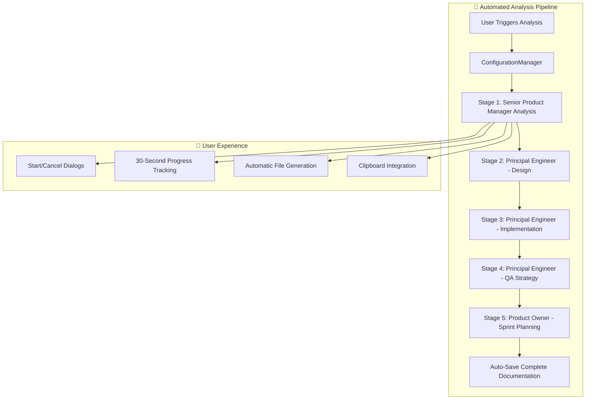

# AI Product Owner Agent - Developer Guide

## 📋 Table of Contents
1. [Architecture Overview](#architecture-overview)
2. [Development Environment](#development-environment)
3. [Project Structure](#project-structure)
4. [Core Components](#core-components)
5. [Context Engineering](#context-engineering)
6. [Testing Framework](#testing-framework)
7. [Debugging Guidelines](#debugging-guidelines)
8. [Contributing Standards](#contributing-standards)

## 🏗️ Architecture Overview

### Current System Architecture

The AI Product Owner Agent implements a configuration-driven, automated UX architecture with comprehensive resource management and 30-second interval-based progress tracking.



### Design Principles

- **Configuration-Driven**: All behavior controlled through centralized configuration management
- **Automated UX**: Start/cancel dialogs, 30-second progress intervals, automatic file generation
- **Resource Management**: Proper disposal patterns, interval cleanup, memory management
- **Error Resilience**: Comprehensive error handling with user-friendly messages
- **Progressive Analysis**: Each stage builds on previous stage results with full context
- **Professional Output**: Production-ready technical documentation generation

## 🚀 Development Environment

### System Requirements

```bash
# Node.js and npm versions
node --version    # v18.0.0 or higher
npm --version     # v9.0.0 or higher

# VS Code development
code --version    # 1.74.0 or higher

# TypeScript tooling
tsc --version     # 4.9.0 or higher
```

### Environment Setup

```bash
# Clone the repository
git clone https://github.com/Srinidhi94/Product-Owner-AI-Agent.git
cd Product-Owner-AI-Agent

# Install dependencies
npm install

# Build the extension
npm run compile

# Launch development environment
code .

# Start debugging (F5) to launch Extension Development Host
```

### Development Workflow

1. **Continuous Compilation**: `npm run watch` for automatic TypeScript compilation
2. **Extension Testing**: Press `F5` to launch development host with extension loaded
3. **Unit Testing**: `npm test` for comprehensive test validation
4. **Code Quality**: `npm run lint` for style and quality checks
5. **Package Creation**: `npm run package` for distribution-ready builds

## 📁 Project Structure

```
src/
├── analysis/              # Multi-stage analysis orchestration
│   └── MultiStageAnalysisEngine.ts   # 30-second intervals, config integration
├── analyzer/              # Universal codebase analysis
│   └── CodebaseAnalyzer.ts           # Multi-language pattern detection
├── jira/                  # Jira API integration
│   └── JiraClient.ts                 # Secure API integration
├── output/                # Automated documentation generation
│   └── DocumentGenerator.ts          # Config-driven file creation
├── prompts/               # Context-rich prompt generation
│   ├── PromptGenerator.ts            # Stage-based prompt creation
│   └── PromptTemplates.ts            # Role-based templates
├── types/                 # TypeScript definitions
│   └── index.ts                      # Core type definitions
├── utils/                 # Utility components
│   ├── ConfigurationManager.ts      # Centralized configuration
│   ├── ErrorHandler.ts              # Comprehensive error handling
│   ├── Logger.ts                    # Structured logging system
│   └── WelcomeManager.ts            # User onboarding
└── extension.ts           # Extension entry point & command registration
```

## 🧩 Core Components

### MultiStageAnalysisEngine

**Purpose**: Orchestrates the complete automated analysis workflow with proper UX.

**Key Features**:
- **ConfigurationManager Integration**: Uses centralized configuration for all settings
- **30-Second Progress Tracking**: Promise-based interval checking with proper cleanup
- **Start/Cancel Dialogs**: User-friendly workflow control
- **Automatic File Generation**: Creates output structure on analysis start
- **Resource Management**: Proper disposal of intervals and VS Code resources

**API**:
```typescript
class MultiStageAnalysisEngine {
  constructor();
  executeAnalysis(epicKey: string, jiraData: JiraPortfolio, codebaseData: CodebaseAnalysis): Promise<void>;
  cancel(): void;
  isCancelled(): boolean;
  getStages(): AnalysisStage[];
  dispose(): void;
}
```

### ConfigurationManager

**Purpose**: Centralized configuration management for the entire extension.

**Configuration Categories**:
- **JIRA Configuration**: API endpoints, authentication, timeouts
- **Output Configuration**: Directory paths, file naming, template selection
- **Analysis Configuration**: Stage settings, prompt customization, logging levels

**API**:
```typescript
class ConfigurationManager {
  getJiraConfiguration(): JiraConfig;
  getOutputConfiguration(): OutputConfig;
  getAnalysisConfiguration(): AnalysisConfig;
  validateConfiguration(): boolean;
  updateConfiguration(key: string, value: any): Promise<void>;
  dispose(): void;
}
```

### DocumentGenerator

**Purpose**: Automated creation and management of analysis output files.

**Key Features**:
- **Configuration-Driven Output**: Uses ConfigurationManager for directory settings
- **Automatic Structure Creation**: Creates folders and files on analysis start
- **Template System**: Professional markdown templates with proper formatting
- **Real-time Updates**: Updates files as analysis progresses

**API**:
```typescript
class DocumentGenerator {
  initializeOutputStructure(epicKey: string): Promise<string>;
  addPromptToDocument(epicKey: string, stageId: string, stageName: string, prompt: string): Promise<void>;
  addResponseToAnalysis(epicKey: string, stageId: string, response: string): Promise<void>;
  dispose(): void;
}
```

## 🔧 Context Engineering

### Context Engineering Protocol

The AI Product Owner Agent implements sophisticated context engineering to provide GitHub Copilot with comprehensive, role-based prompts for technical analysis.

### Automated Sequential Analysis Architecture

**Key Principle**: Each role receives the complete analysis from previous stages as context, processed through a structured 5-stage workflow.



### Role-Based Analysis Stages

#### Stage 1: Senior Product Manager
- **Role**: Business requirements analysis specialist
- **Focus**: User stories, business value, market requirements
- **Context**: JIRA epic data, business objectives, user personas
- **Output**: Comprehensive product requirements document

#### Stage 2: Principal Engineer - System Architecture
- **Role**: System architecture and design leadership
- **Focus**: High-level system design, technology decisions, scalability
- **Context**: Product requirements + codebase analysis + technology constraints
- **Output**: System architecture design with diagrams

#### Stage 3: Principal Engineer - Technical Design
- **Role**: Detailed technical specification expert
- **Focus**: API design, data models, component interactions
- **Context**: System architecture + detailed codebase patterns + integration requirements
- **Output**: Comprehensive technical design specification

#### Stage 4: Principal Engineer - Implementation Strategy
- **Role**: Implementation and deployment strategist
- **Focus**: Development approach, deployment pipeline, quality assurance
- **Context**: Technical design + development constraints + operational requirements
- **Output**: Implementation and deployment strategy

#### Stage 5: Product Owner - Sprint Planning
- **Role**: Agile delivery and sprint planning expert
- **Focus**: Task breakdown, sprint organization, JIRA epic structuring
- **Context**: Complete technical analysis + implementation strategy + team capacity
- **Output**: Sprint planning and JIRA epic breakdown

### Context Integration Patterns

#### Codebase Context Integration
```typescript
interface CodebaseContext {
  languages: string[];                    // Detected programming languages
  frameworks: string[];                   // Identified frameworks and libraries
  patterns: ArchitecturalPattern[];       // Detected architectural patterns
  complexity: ComplexityMetrics;          // Code complexity analysis
  dependencies: DependencyMap;            // External and internal dependencies
  fileStructure: ProjectStructure;        // Organized file and folder structure
}
```

#### JIRA Context Integration
```typescript
interface JiraContext {
  epic: EpicDetails;                      // Epic information and requirements
  stories: UserStory[];                   // Associated user stories
  acceptance: AcceptanceCriteria[];       // Acceptance criteria and definitions
  business: BusinessContext;              // Business value and priorities
  timeline: ProjectTimeline;              // Deadlines and milestones
}
```

#### Progressive Context Building
```typescript
interface StageContext {
  previousStages: StageResult[];          // Results from completed stages
  currentStage: StageConfiguration;       // Current stage configuration
  codebaseContext: CodebaseContext;       // Full codebase analysis
  jiraContext: JiraContext;               // JIRA epic and story data
  userConfiguration: UserPreferences;    // User settings and preferences
}
```

### Prompt Engineering Standards

#### Context-Rich Prompt Structure
```markdown
# Role: [Specific Role and Expertise Level]
# Context: [Previous Stage Results + Codebase Analysis + JIRA Data]
# Objective: [Specific Analysis Objective]
# Output Requirements: [Exact Output Format and Content Requirements]
# Quality Standards: [Principal Engineer-level Requirements]

## Previous Analysis Context
[Complete results from previous stages]

## Codebase Analysis Context
[Comprehensive codebase analysis results]

## JIRA Epic Context
[Full epic and user story information]

## Analysis Instructions
[Detailed, role-specific analysis instructions]

## Output Format Requirements
[Exact markdown format specifications with required sections]
```

### Coding Standards and Conventions

#### TypeScript Standards
```typescript
// ✅ Explicit return types for all functions
async function analyzeCodebase(path: string): Promise<CodebaseAnalysis> {
  // Implementation with proper error handling
}

// ✅ Interface definitions for all data structures
interface AnalysisStage {
  id: string;
  name: string;
  duration: string;
  icon: string;
  description: string;
  requiredDiagrams: string[];
}

// ✅ Proper error handling with typed exceptions
try {
  const result = await riskyOperation();
  return result;
} catch (error: unknown) {
  this.errorHandler.handleError(error as Error, context);
  throw error;
}
```

#### Resource Management Patterns
```typescript
export class ComponentClass {
  private outputChannel: vscode.OutputChannel;
  private intervalId: ReturnType<typeof setInterval> | null = null;
  
  constructor() {
    this.outputChannel = vscode.window.createOutputChannel('Component');
  }
  
  // ✅ Proper resource disposal
  dispose(): void {
    if (this.intervalId) {
      clearInterval(this.intervalId);
      this.intervalId = null;
    }
    this.outputChannel.dispose();
  }
}
```

#### Configuration Pattern
```typescript
interface ComponentConfig {
  timeout: number;
  retryAttempts: number;
  enableLogging: boolean;
}

private getConfiguration(): ComponentConfig {
  const config = vscode.workspace.getConfiguration('aiProductOwner');
  return {
    timeout: config.get<number>('timeout') ?? 30000,
    retryAttempts: config.get<number>('retryAttempts') ?? 3,
    enableLogging: config.get<boolean>('enableLogging') ?? true
  };
}
```

### Development Guidelines

#### Before Making Changes
1. **Check Compilation**: Ensure `npm run compile` passes without warnings
2. **Run Tests**: Execute `npm test` to verify existing functionality
3. **Review Dependencies**: Check if new dependencies are necessary and justified
4. **Validate Configuration**: Test configuration changes with various settings

#### Development Workflow
1. **Atomic Changes**: Make small, focused changes that can be easily reviewed
2. **Test-Driven**: Write tests before implementing new features
3. **Error Handling**: Implement comprehensive error handling for all new code
4. **Documentation**: Update relevant documentation (README, CHANGELOG, etc.)
5. **Resource Management**: Ensure proper disposal of all VS Code resources

#### Performance Considerations
- **Efficient File Operations**: Limit file system operations to necessary files only
- **Caching Strategy**: Implement caching for expensive operations (codebase analysis, JIRA API calls)
- **Async Operations**: Use async/await properly to avoid blocking the UI thread
- **Resource Cleanup**: Dispose of all VS Code resources (output channels, intervals, etc.)

#### Security Guidelines
- **Data Privacy**: Never log sensitive data (API tokens, user credentials)
- **Input Validation**: Sanitize all user inputs before processing
- **Secure Storage**: Use VS Code secrets API for storing sensitive configuration
- **Data Validation**: Validate all external data (JIRA API responses, file contents)

## 🧪
│   └── JiraClient.ts
├── output/                # Documentation generation
│   └── DocumentGenerator.ts
├── prompts/               # AI prompt engineering
│   ├── PromptGenerator.ts
│   └── PromptTemplates.ts
├── types/                 # TypeScript type definitions
│   └── index.ts
├── utils/                 # Utility modules
│   ├── ConfigurationManager.ts
│   ├── ErrorHandler.ts
│   ├── Logger.ts
│   ├── PerformanceMonitor.ts
│   └── WelcomeManager.ts
├── visualization/         # Diagram generation
└── extension.ts           # Extension entry point
```

### File Responsibilities

- **extension.ts**: Extension lifecycle, command registration, and user interface
- **MultiStageAnalysisEngine.ts**: Orchestrates five-stage analysis workflow
- **CodebaseAnalyzer.ts**: Universal language analysis supporting 9 programming languages
- **JiraClient.ts**: Secure Jira API integration with authentication and error handling
- **PromptGenerator.ts**: Context-rich prompt generation for GitHub Copilot integration
- **DocumentGenerator.ts**: Technical documentation and artifact generation
## 🔑 Core Components

### MultiStageAnalysisEngine

**Purpose**: Central orchestrator for the five-stage analysis workflow

**Key Responsibilities**:
- Progress tracking and user interface management
- Stage coordination and data flow
- Error handling and recovery
- User interaction dialogs

**Extension Points**:
```typescript
// Adding new analysis stages
private stages: AnalysisStage[] = [
  {
    id: 'custom-analysis',
    name: 'Custom Analysis',
    description: 'Custom analysis description',
    requiredDiagrams: ['Custom Flow Diagram']
  }
];
```

### Universal CodebaseAnalyzer

**Purpose**: Multi-language codebase analysis engine

**Supported Languages**:
- JavaScript/TypeScript: React, Node.js, Angular, Vue.js patterns
- Python: Django, Flask, FastAPI, data science libraries
- Java: Spring, Maven, Gradle project structures
- C#: .NET, ASP.NET Core, Entity Framework patterns
- Go: Gin, Echo, standard library patterns
- PHP: Laravel, Symfony, Composer dependencies
- Ruby: Rails, Sinatra, Gem management
- Rust: Cargo, async patterns, memory management

**Analysis Capabilities**:
```typescript
interface LanguageAnalysis {
  language: string;
  framework?: string;
  dependencies: Dependency[];
  architecture: ArchitecturePattern[];
  complexity: ComplexityMetrics;
  testCoverage?: TestMetrics;
}
```

### JiraClient

**Purpose**: Secure Jira API integration with comprehensive error handling

**Features**:
- OAuth 2.0 and API token authentication
- Rate limiting and retry logic
- Comprehensive epic and story data extraction
- Custom field support

**Configuration**:
```typescript
interface JiraConfig {
  baseUrl: string;
  email: string;
  token: string;
  apiVersion?: string;
  timeout?: number;
}
```

### PromptGenerator

**Purpose**: Context-rich prompt generation for GitHub Copilot integration

**Template System**:
- Variable substitution with validation
- Stage-specific prompt optimization
- Context preservation across stages
- Copilot-optimized formatting

**Template Variables**:
```typescript
interface PromptContext {
  epicKey: string;
  epicSummary: string;
  epicStories: JiraStory[];
  codebaseAnalysis: UniversalAnalysis;
  previousStageResults?: string;
}
```

## 🧪 Testing Framework

### Unit Testing Strategy

**Test Structure**:
```typescript
describe('UniversalCodebaseAnalyzer', () => {
  let analyzer: CodebaseAnalyzer;
  
  beforeEach(() => {
    analyzer = new CodebaseAnalyzer();
  });
  
  it('should detect TypeScript React project', async () => {
    const mockWorkspace = createMockTypeScriptProject();
    const analysis = await analyzer.analyzeProject(mockWorkspace);
    
    expect(analysis.language).toBe('typescript');
    expect(analysis.framework).toBe('react');
    expect(analysis.dependencies).toContain('react');
  });
  
  it('should handle multi-language projects', async () => {
    const mockWorkspace = createMockMultiLanguageProject();
    const analysis = await analyzer.analyzeProject(mockWorkspace);
    
    expect(analysis.languages).toHaveLength(3);
    expect(analysis.primaryLanguage).toBe('typescript');
  });
});
```

### Integration Testing

**Workflow Testing**:
```typescript
describe('End-to-End Analysis Workflow', () => {
  it('should complete five-stage analysis', async () => {
    const engine = new MultiStageAnalysisEngine();
    const mockProgress = createMockProgressReporter();
    
    await engine.runFullAnalysis('EPIC-123', {
      jiraData: mockJiraData,
      workspacePath: mockWorkspacePath
    }, mockProgress);
    
    expect(mockProgress.report).toHaveBeenCalledTimes(5);
    expect(fs.existsSync('TECHNICAL_ANALYSIS.md')).toBe(true);
  });
});
```

### Test Data Management

**Mock Data Structure**:
```typescript
const mockJiraEpic = {
  key: 'EPIC-123',
  summary: 'User Authentication System',
  description: 'Implement secure user authentication',
  stories: [
    {
      key: 'STORY-456',
      summary: 'Login API endpoint',
      acceptanceCriteria: ['Secure password validation', 'JWT token generation']
    }
  ]
};
```

## 🐞 Debugging Guidelines

### Debug Configuration

**VS Code Launch Configuration**:
```json
{
  "name": "Extension Development",
  "type": "extensionHost",
  "request": "launch",
  "args": ["--extensionDevelopmentPath=${workspaceFolder}"],
  "outFiles": ["${workspaceFolder}/out/**/*.js"],
  "preLaunchTask": "npm: compile",
  "env": {
    "LOG_LEVEL": "debug"
  }
}
```

### Debugging Techniques

**Logging Strategy**:
```typescript
import { Logger } from './utils/Logger';

const logger = Logger.getInstance();

// Different log levels for debugging
logger.debug('Detailed debugging information');
logger.info('General information');
logger.warn('Warning conditions');
logger.error('Error conditions', error);
```

**Performance Monitoring**:
```typescript
import { PerformanceMonitor } from './utils/PerformanceMonitor';

const monitor = PerformanceMonitor.getInstance();
monitor.startTimer('codebase-analysis');
// ... analysis logic
monitor.endTimer('codebase-analysis');
```

### Common Issues and Solutions

**Authentication Problems**:
- Validate Jira credentials in VS Code settings
- Check network connectivity and firewall settings
- Verify API token permissions and expiration

**Performance Issues**:
- Monitor large codebase analysis performance
- Implement caching for repeated operations
- Use async/await patterns for non-blocking operations

**Extension Compatibility**:
- Test with different VS Code versions
- Validate against VS Code API changes
- Handle deprecated API gracefully

## 🤝 Contributing Standards

### Development Workflow

1. **Feature Development**:
   ```bash
   git checkout -b feature/universal-language-support
   npm run watch  # Continuous compilation
   # Develop and test changes
   npm test       # Run test suite
   npm run lint   # Code quality checks
   ```

2. **Code Quality Standards**:
   - TypeScript strict mode enforcement
   - Comprehensive error handling
   - JSDoc documentation for public APIs
   - Unit test coverage for new features

3. **Pull Request Process**:
   - Clear description of changes and motivation
   - Include test coverage for new functionality
   - Update documentation for user-facing changes
   - Follow existing architectural patterns

### Code Style Guidelines

**TypeScript Standards**:
```typescript
// Use explicit types and interfaces
interface AnalysisConfig {
  readonly languages: string[];
  readonly outputPath: string;
  readonly includeTests: boolean;
}

// Error handling with custom error types
class AnalysisError extends Error {
  constructor(
    message: string, 
    public readonly code: string,
    public readonly stage?: string
  ) {
    super(message);
    this.name = 'AnalysisError';
  }
}

// Async/await with proper error handling
async function analyzeCodebase(config: AnalysisConfig): Promise<AnalysisResult> {
  try {
    const result = await performAnalysis(config);
    return result;
  } catch (error) {
    throw new AnalysisError(
      `Analysis failed: ${error.message}`,
      'ANALYSIS_FAILED',
      'codebase-analysis'
    );
  }
}
```

### Release Management

**Version Strategy**:
- **Patch** (1.0.x): Bug fixes and minor improvements
- **Minor** (1.x.0): New features and language support
- **Major** (x.0.0): Breaking changes and architecture updates

**Release Process**:
```bash
# Update version and changelog
npm version minor
git push --tags

# Build and validate
npm run compile
npm test
npm run package

# Create release notes and publish
vsce publish
```

---

*For user instructions, see [USER_GUIDE.md](USER_GUIDE.md). For system architecture details, see [ARCHITECTURE.md](ARCHITECTURE.md).*

---

This developer guide provides the technical foundation for maintaining and extending the AI Product Owner Agent. For user documentation, see the [User Guide](USER_GUIDE.md). 