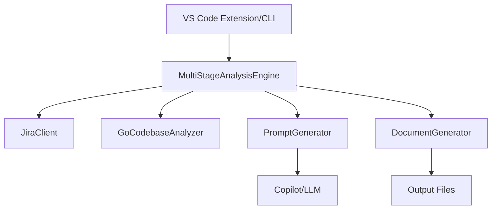

# AI Product Owner Agent - Developer Guide

---

## 📋 Table of Contents
1. [Architecture Overview](#architecture-overview)
2. [Development Setup](#development-setup)
3. [Code Structure](#code-structure)
4. [Key Components](#key-components)
5. [Extension Points](#extension-points)
6. [Testing Strategy](#testing-strategy)
7. [Debugging](#debugging)
8. [Contributing](#contributing)

---

## 🏗️ Architecture Overview

### System Design
The AI Product Owner Agent follows a modular, extensible architecture with clear separation of concerns:



### Core Components
- **extension.ts**: Entry point, command registration, and user interaction
- **MultiStageAnalysisEngine**: Orchestrates the workflow, manages progress, coordinates all components
- **JiraClient**: API integration with authentication
- **GoCodebaseAnalyzer**: Static code analysis
- **PromptGenerator**: AI prompt creation (Context7/Anthropic style)
- **DocumentGenerator**: Output file management
- **ErrorHandler**: Comprehensive error management

---

## 🚀 Development Setup

### Prerequisites
```bash
node --version    # v16+ required
npm --version     # v8+ required
code --version    # VS Code 1.74+ required
```

### Initial Setup
```bash
# Clone repository
git clone https://github.com/your-company/ai-product-owner-agent.git
cd ai-product-owner-agent

# Install dependencies
npm install

# Build extension
npm run compile

# Start debugging
code .
# Press F5 to launch Extension Development Host
```

### Development Workflow
1. **Watch Mode**: `npm run watch` for automatic compilation
2. **Debug Extension**: Press F5 to test in development host
3. **Run Tests**: `npm test` for validation
4. **Package**: `vsce package` for distribution

---

## 📁 Code Structure

```
src/
├── analysis/           # Multi-stage analysis engine
├── analyzer/           # Go codebase analysis
├── jira/               # Jira API integration
├── prompts/            # AI prompt generation
├── types/              # TypeScript definitions
├── utils/              # Utility modules
└── extension.ts        # Main entry point
```

### Key Files
- `extension.ts` - Extension activation and command registration
- `jira/JiraClient.ts` - Jira API integration with authentication
- `analyzer/GoCodebaseAnalyzer.ts` - Go source code analysis
- `analysis/MultiStageAnalysisEngine.ts` - 5-stage analysis workflow
- `prompts/PromptGenerator.ts` - AI prompt generation
- `output/DocumentGenerator.ts` - Output file management
- `utils/ErrorHandler.ts` - Error management and user guidance

---

## 🔑 Extension Points

### Adding New Analysis Stages
To add a new analysis stage:
1. **Update Stage Definition** in `MultiStageAnalysisEngine.ts`:
```typescript
private stages: AnalysisStage[] = [
  // ... existing stages
  {
    id: 'custom-analysis',
    name: 'Custom Analysis',
    description: 'Custom analysis description',
    requiredDiagrams: ['Custom Diagram']
  }
];
```
2. **Create Prompt Template** in `PromptGenerator.ts`:
```typescript
export const CUSTOM_ANALYSIS_TEMPLATE = `
You are a Custom Analysis Expert...

## Context
Epic: {{epicKey}} - {{epicSummary}}

## Requirements
Analyze and provide:
1. Custom analysis point 1
2. Custom analysis point 2

## Required Diagrams
Generate Mermaid diagram for custom flow.
`;
```
3. **Update Output Logic** in `DocumentGenerator.ts` as needed.

### Customizing Prompt Templates
Templates support variable substitution:
- `{{epicKey}}` - Epic identifier
- `{{epicSummary}}` - Epic title
- `{{epicStories}}` - Array of stories
- `{{codebaseData.*}}` - Codebase analysis results

---

## 🧪 Testing Strategy

### Unit Tests
```typescript
describe('PromptGenerator', () => {
  let generator: PromptGenerator;
  beforeEach(() => {
    generator = new PromptGenerator();
  });
  it('should generate business analysis prompt', async () => {
    const prompt = await generator.generatePrompt(
      'business-analysis',
      mockJiraPortfolio,
      mockCodebaseAnalysis
    );
    expect(prompt.content).toContain('business requirements');
    expect(prompt.metadata.stage).toBe('business-analysis');
  });
});
```

### Integration Tests
```typescript
describe('Epic Analysis Workflow', () => {
  it('should complete full analysis', async () => {
    const engine = new MultiStageAnalysisEngine();
    await engine.runFullAnalysis('TEST-123', mockData, mockProgress);
    expect(mockProgress.report).toHaveBeenCalledTimes(5);
  });
});
```

---

## 🐞 Debugging

### Debug Configuration
```json
{
  "name": "Extension",
  "type": "extensionHost",
  "request": "launch",
  "args": ["--extensionDevelopmentPath=${workspaceFolder}"],
  "outFiles": ["${workspaceFolder}/out/**/*.js"]
}
```

### Debug Techniques
1. **Console Logging**: Use `console.log` for debugging
2. **Breakpoints**: Set breakpoints in TypeScript source
3. **Output Panel**: Check "AI Product Owner" output channel
4. **Developer Tools**: Use Help → Toggle Developer Tools

### Common Issues
- **Authentication Errors**: Check Jira credentials and permissions
- **Timeout Issues**: Adjust network timeout settings
- **Parse Errors**: Validate JSON responses from Jira API

---

## 🤝 Contributing

### Development Process
1. Fork repository and create feature branch
2. Make changes following coding standards
3. Add tests for new functionality
4. Submit pull request with description

### Coding Standards
- Use TypeScript strict mode
- Follow ESLint rules
- Add JSDoc comments for public APIs
- Use ErrorHandler for user-facing errors
- Write tests for new features

### Pull Request Guidelines
- Clear description of changes
- Include test coverage
- Update documentation if needed
- Follow existing code patterns

### Release Process
1. Update version: `npm version [patch|minor|major]`
2. Update changelog
3. Create Git tag
4. Build package: `vsce package`
5. Publish: `vsce publish`

---

This developer guide provides the technical foundation for maintaining and extending the AI Product Owner Agent. For user documentation, see the [User Guide](USER_GUIDE.md). 