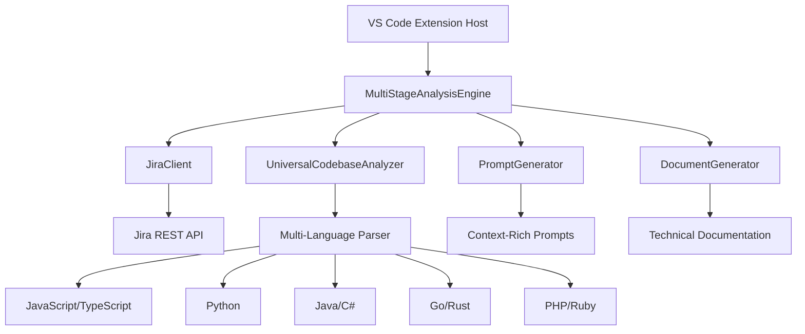

# AI Product Owner Agent - Developer Guide

## 📋 Table of Contents
1. [Architecture Overview](#architecture-overview)
2. [Development Environment](#development-environment)
3. [Project Structure](#project-structure)
4. [Core Components](#core-components)
5. [Extension Development](#extension-development)
6. [Testing Framework](#testing-framework)
7. [Debugging Guidelines](#debugging-guidelines)
8. [Contributing Standards](#contributing-standards)

## 🏗️ Architecture Overview

### System Architecture

The AI Product Owner Agent implements a modular, extensible architecture with clear separation of concerns and support for universal codebase analysis across multiple programming languages.



### Design Principles

- **Modularity**: Each component has a single, well-defined responsibility
- **Extensibility**: New language support and analysis stages can be added easily
- **Testability**: Components are designed for comprehensive unit and integration testing
- **Error Resilience**: Robust error handling and graceful degradation
- **Performance**: Efficient processing of large codebases with multiple languages

## 🚀 Development Environment

### System Requirements

```bash
# Node.js and npm versions
node --version    # v18.0.0 or higher
npm --version     # v9.0.0 or higher

# VS Code development
code --version    # 1.74.0 or higher

# TypeScript tooling
tsc --version     # 4.9.0 or higher
```

### Environment Setup

```bash
# Clone the repository
git clone https://github.com/Srinidhi94/Product-Owner-AI-Agent.git
cd Product-Owner-AI-Agent

# Install dependencies
npm install

# Build the extension
npm run compile

# Launch development environment
code .

# Start debugging (F5) to launch Extension Development Host
```

### Development Workflow

1. **Continuous Compilation**: `npm run watch` for automatic TypeScript compilation
2. **Extension Testing**: Press `F5` to launch development host with extension loaded
3. **Unit Testing**: `npm test` for comprehensive test validation
4. **Code Quality**: `npm run lint` for style and quality checks
5. **Package Creation**: `npm run package` for distribution-ready builds

## 📁 Project Structure

```
src/
├── analysis/              # Multi-stage analysis orchestration
│   └── MultiStageAnalysisEngine.ts
├── analyzer/              # Universal codebase analysis
│   └── CodebaseAnalyzer.ts
├── jira/                  # Jira API integration
│   └── JiraClient.ts
├── output/                # Documentation generation
│   └── DocumentGenerator.ts
├── prompts/               # AI prompt engineering
│   ├── PromptGenerator.ts
│   └── PromptTemplates.ts
├── types/                 # TypeScript type definitions
│   └── index.ts
├── utils/                 # Utility modules
│   ├── ConfigurationManager.ts
│   ├── ErrorHandler.ts
│   ├── Logger.ts
│   ├── PerformanceMonitor.ts
│   └── WelcomeManager.ts
├── visualization/         # Diagram generation
└── extension.ts           # Extension entry point
```

### File Responsibilities

- **extension.ts**: Extension lifecycle, command registration, and user interface
- **MultiStageAnalysisEngine.ts**: Orchestrates five-stage analysis workflow
- **CodebaseAnalyzer.ts**: Universal language analysis supporting 9 programming languages
- **JiraClient.ts**: Secure Jira API integration with authentication and error handling
- **PromptGenerator.ts**: Context-rich prompt generation for GitHub Copilot integration
- **DocumentGenerator.ts**: Technical documentation and artifact generation
## 🔑 Core Components

### MultiStageAnalysisEngine

**Purpose**: Central orchestrator for the five-stage analysis workflow

**Key Responsibilities**:
- Progress tracking and user interface management
- Stage coordination and data flow
- Error handling and recovery
- User interaction dialogs

**Extension Points**:
```typescript
// Adding new analysis stages
private stages: AnalysisStage[] = [
  {
    id: 'custom-analysis',
    name: 'Custom Analysis',
    description: 'Custom analysis description',
    requiredDiagrams: ['Custom Flow Diagram']
  }
];
```

### Universal CodebaseAnalyzer

**Purpose**: Multi-language codebase analysis engine

**Supported Languages**:
- JavaScript/TypeScript: React, Node.js, Angular, Vue.js patterns
- Python: Django, Flask, FastAPI, data science libraries
- Java: Spring, Maven, Gradle project structures
- C#: .NET, ASP.NET Core, Entity Framework patterns
- Go: Gin, Echo, standard library patterns
- PHP: Laravel, Symfony, Composer dependencies
- Ruby: Rails, Sinatra, Gem management
- Rust: Cargo, async patterns, memory management

**Analysis Capabilities**:
```typescript
interface LanguageAnalysis {
  language: string;
  framework?: string;
  dependencies: Dependency[];
  architecture: ArchitecturePattern[];
  complexity: ComplexityMetrics;
  testCoverage?: TestMetrics;
}
```

### JiraClient

**Purpose**: Secure Jira API integration with comprehensive error handling

**Features**:
- OAuth 2.0 and API token authentication
- Rate limiting and retry logic
- Comprehensive epic and story data extraction
- Custom field support

**Configuration**:
```typescript
interface JiraConfig {
  baseUrl: string;
  email: string;
  token: string;
  apiVersion?: string;
  timeout?: number;
}
```

### PromptGenerator

**Purpose**: Context-rich prompt generation for GitHub Copilot integration

**Template System**:
- Variable substitution with validation
- Stage-specific prompt optimization
- Context preservation across stages
- Copilot-optimized formatting

**Template Variables**:
```typescript
interface PromptContext {
  epicKey: string;
  epicSummary: string;
  epicStories: JiraStory[];
  codebaseAnalysis: UniversalAnalysis;
  previousStageResults?: string;
}
```

## 🧪 Testing Framework

### Unit Testing Strategy

**Test Structure**:
```typescript
describe('UniversalCodebaseAnalyzer', () => {
  let analyzer: CodebaseAnalyzer;
  
  beforeEach(() => {
    analyzer = new CodebaseAnalyzer();
  });
  
  it('should detect TypeScript React project', async () => {
    const mockWorkspace = createMockTypeScriptProject();
    const analysis = await analyzer.analyzeProject(mockWorkspace);
    
    expect(analysis.language).toBe('typescript');
    expect(analysis.framework).toBe('react');
    expect(analysis.dependencies).toContain('react');
  });
  
  it('should handle multi-language projects', async () => {
    const mockWorkspace = createMockMultiLanguageProject();
    const analysis = await analyzer.analyzeProject(mockWorkspace);
    
    expect(analysis.languages).toHaveLength(3);
    expect(analysis.primaryLanguage).toBe('typescript');
  });
});
```

### Integration Testing

**Workflow Testing**:
```typescript
describe('End-to-End Analysis Workflow', () => {
  it('should complete five-stage analysis', async () => {
    const engine = new MultiStageAnalysisEngine();
    const mockProgress = createMockProgressReporter();
    
    await engine.runFullAnalysis('EPIC-123', {
      jiraData: mockJiraData,
      workspacePath: mockWorkspacePath
    }, mockProgress);
    
    expect(mockProgress.report).toHaveBeenCalledTimes(5);
    expect(fs.existsSync('TECHNICAL_ANALYSIS.md')).toBe(true);
  });
});
```

### Test Data Management

**Mock Data Structure**:
```typescript
const mockJiraEpic = {
  key: 'EPIC-123',
  summary: 'User Authentication System',
  description: 'Implement secure user authentication',
  stories: [
    {
      key: 'STORY-456',
      summary: 'Login API endpoint',
      acceptanceCriteria: ['Secure password validation', 'JWT token generation']
    }
  ]
};
```

## 🐞 Debugging Guidelines

### Debug Configuration

**VS Code Launch Configuration**:
```json
{
  "name": "Extension Development",
  "type": "extensionHost",
  "request": "launch",
  "args": ["--extensionDevelopmentPath=${workspaceFolder}"],
  "outFiles": ["${workspaceFolder}/out/**/*.js"],
  "preLaunchTask": "npm: compile",
  "env": {
    "LOG_LEVEL": "debug"
  }
}
```

### Debugging Techniques

**Logging Strategy**:
```typescript
import { Logger } from './utils/Logger';

const logger = Logger.getInstance();

// Different log levels for debugging
logger.debug('Detailed debugging information');
logger.info('General information');
logger.warn('Warning conditions');
logger.error('Error conditions', error);
```

**Performance Monitoring**:
```typescript
import { PerformanceMonitor } from './utils/PerformanceMonitor';

const monitor = PerformanceMonitor.getInstance();
monitor.startTimer('codebase-analysis');
// ... analysis logic
monitor.endTimer('codebase-analysis');
```

### Common Issues and Solutions

**Authentication Problems**:
- Validate Jira credentials in VS Code settings
- Check network connectivity and firewall settings
- Verify API token permissions and expiration

**Performance Issues**:
- Monitor large codebase analysis performance
- Implement caching for repeated operations
- Use async/await patterns for non-blocking operations

**Extension Compatibility**:
- Test with different VS Code versions
- Validate against VS Code API changes
- Handle deprecated API gracefully

## 🤝 Contributing Standards

### Development Workflow

1. **Feature Development**:
   ```bash
   git checkout -b feature/universal-language-support
   npm run watch  # Continuous compilation
   # Develop and test changes
   npm test       # Run test suite
   npm run lint   # Code quality checks
   ```

2. **Code Quality Standards**:
   - TypeScript strict mode enforcement
   - Comprehensive error handling
   - JSDoc documentation for public APIs
   - Unit test coverage for new features

3. **Pull Request Process**:
   - Clear description of changes and motivation
   - Include test coverage for new functionality
   - Update documentation for user-facing changes
   - Follow existing architectural patterns

### Code Style Guidelines

**TypeScript Standards**:
```typescript
// Use explicit types and interfaces
interface AnalysisConfig {
  readonly languages: string[];
  readonly outputPath: string;
  readonly includeTests: boolean;
}

// Error handling with custom error types
class AnalysisError extends Error {
  constructor(
    message: string, 
    public readonly code: string,
    public readonly stage?: string
  ) {
    super(message);
    this.name = 'AnalysisError';
  }
}

// Async/await with proper error handling
async function analyzeCodebase(config: AnalysisConfig): Promise<AnalysisResult> {
  try {
    const result = await performAnalysis(config);
    return result;
  } catch (error) {
    throw new AnalysisError(
      `Analysis failed: ${error.message}`,
      'ANALYSIS_FAILED',
      'codebase-analysis'
    );
  }
}
```

### Release Management

**Version Strategy**:
- **Patch** (1.0.x): Bug fixes and minor improvements
- **Minor** (1.x.0): New features and language support
- **Major** (x.0.0): Breaking changes and architecture updates

**Release Process**:
```bash
# Update version and changelog
npm version minor
git push --tags

# Build and validate
npm run compile
npm test
npm run package

# Create release notes and publish
vsce publish
```

---

*For user instructions, see [USER_GUIDE.md](USER_GUIDE.md). For system architecture details, see [ARCHITECTURE.md](ARCHITECTURE.md).*

---

This developer guide provides the technical foundation for maintaining and extending the AI Product Owner Agent. For user documentation, see the [User Guide](USER_GUIDE.md). 