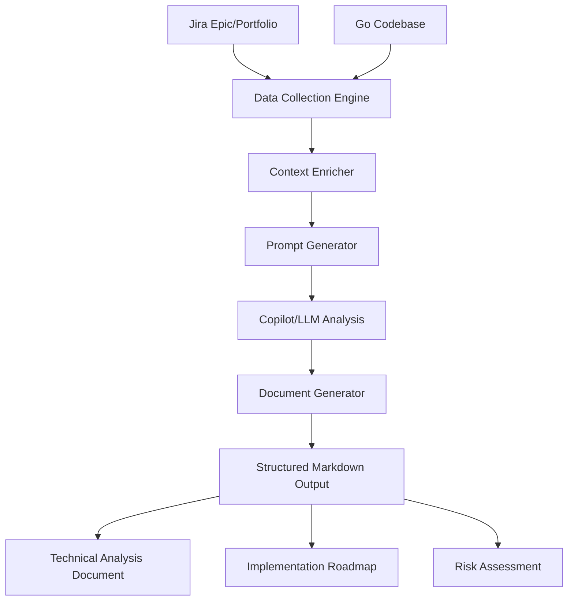

# AI Product Owner Agent - Product Requirements Document (PRD)

## Executive Summary
The AI Product Owner Agent is a VS Code extension and CLI tool that automates the technical analysis of Jira epics and Go codebases. It generates comprehensive, implementation-ready technical documentation and prompt workflows for GitHub Copilot, saving engineering teams days of manual effort and ensuring consistent, high-quality output.

## Problem Statement
- **Manual Analysis Overhead:** Senior engineers spend days translating Jira requirements into technical designs and task breakdowns.
- **Inconsistent Output:** Technical designs and documentation vary in quality and completeness.
- **Context Gaps:** Lack of structured, repeatable frameworks for technical decision-making.

## Solution Overview
The AI Product Owner Agent automates the end-to-end analysis workflow:
- Fetches Jira epic/portfolio data and Go codebase structure
- Enriches context and generates multi-stage, context-rich prompts
- Guides Copilot (or any LLM) through a 5-stage technical analysis
- Produces structured, actionable documentation and implementation plans

## Solution Architecture

## Key Features
- **Automated Jira & Codebase Analysis**
- **Multi-Stage Prompt Generation** (Requirements, Design, Technical Design, Infra/NFR, Task Breakdown)
- **Context7/Anthropic-Style Prompt Engineering**
- **Copilot Integration** (Guided, context-rich prompts)
- **Structured Output** (Markdown docs, diagrams, Jira-ready tasks)
- **Risk Assessment & Decision Log**
- **Reusable Prompts & Documentation**

## Workflow
1. **User triggers analysis** (VS Code command or CLI)
2. **Jira and codebase data collected**
3. **Context is enriched and prompts are generated**
4. **User pastes prompts into Copilot, receives responses**
5. **Extension saves responses and updates documentation**
6. **All output is version-controlled and ready for implementation**

## Output Files
- `TECHNICAL_ANALYSIS.md`: Main analysis document
- `PROMPTS.md`: All generated prompts
- `AUTOMATION_SUMMARY.md`: Workflow summary and next steps
- (For PoC/CLI: single comprehensive prompt file)

## Value Proposition
- **Saves Time:** Reduces analysis from days to under an hour
- **Ensures Consistency:** Standardizes technical documentation and analysis
- **Improves Quality:** Leverages best-practice prompt engineering and AI reasoning
- **Facilitates Collaboration:** Output is ready for team review and sprint planning

## Future Enhancements
- Support for additional languages/frameworks
- Deeper integration with Jira and GitHub APIs
- Automated Copilot response ingestion
- Customizable prompt templates and workflows

---
*For detailed architecture and workflow, see [ARCHITECTURE.md](ARCHITECTURE.md).* 