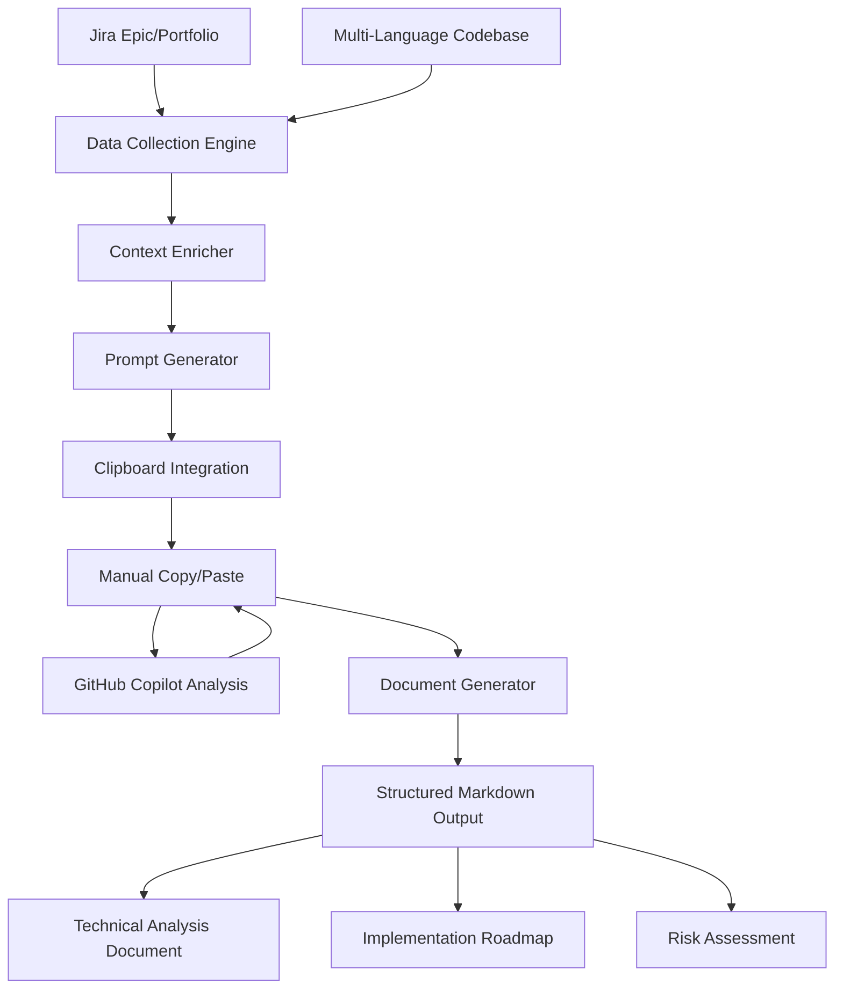
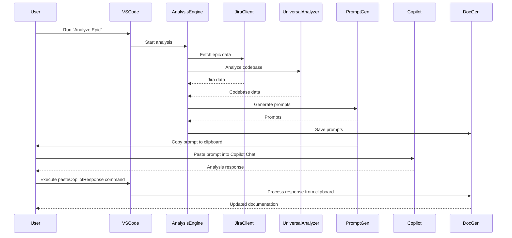

# Product Requirements Document (PRD)
## AI Product Owner Agent VS Code Extension

---

**Document Version:** 2.0  
**Last Updated:** August 2025  
**Document Owner:** Product Management  
**Classification:** Internal Use  

---

## Executive Summary

The AI Product Owner Agent is an enterprise-grade Visual Studio Code extension designed to automate technical analysis and documentation generation for software development projects. The solution integrates seamlessly with JIRA enterprise instances and leverages artificial intelligence to transform business requirements into comprehensive technical documentation, reducing analysis time from days to minutes while maintaining principal engineer-level quality standards.

### Business Value Proposition

- **Operational Efficiency**: Reduce technical analysis cycle time by 95% (from 3-5 days to 30-60 minutes)
- **Quality Standardization**: Ensure consistent, principal engineer-level documentation across all projects
- **Resource Optimization**: Enable senior engineers to focus on architecture and implementation rather than documentation
- **Scalability Enhancement**: Support rapid team scaling without proportional documentation overhead
- **Compliance Assurance**: Maintain standardized technical documentation for audit and governance requirements

## Product Vision & Strategic Objectives

### Vision Statement
To establish the industry standard for AI-assisted technical analysis and documentation, enabling engineering organizations to accelerate delivery while maintaining exceptional quality and consistency in technical decision-making processes.

### Strategic Objectives

1. **Market Leadership**: Achieve recognition as the premier solution for AI-assisted technical documentation
2. **Enterprise Adoption**: Secure adoption by Fortune 500 engineering teams within 18 months
3. **Integration Excellence**: Maintain seamless integration with enterprise development ecosystems
4. **Quality Assurance**: Deliver consistently accurate, actionable technical documentation
5. **Platform Expansion**: Establish foundation for multi-IDE and multi-platform deployment

## Market Analysis & Positioning

### Target Market Segments

**Primary Segment: Enterprise Software Development Teams**
- Team Size: 10-500+ engineers
- Revenue Range: $50M+ annually
- Characteristics: Complex technical requirements, standardization needs, compliance requirements

**Secondary Segment: High-Growth Technology Companies**
- Team Size: 5-50 engineers
- Revenue Range: $10M-$50M annually
- Characteristics: Rapid scaling, resource constraints, quality focus

**Tertiary Segment: Professional Services & Consulting**
- Team Size: Variable project teams
- Revenue Range: $5M+ annually
- Characteristics: Client deliverable focus, documentation standards, efficiency requirements

### Competitive Landscape

The solution operates in the emerging AI-assisted development tools market, competing with:
- Manual technical documentation processes (primary competition)
- Generic AI coding assistants without specialized analysis capabilities
- Traditional project management and documentation tools

**Competitive Advantages:**
- Purpose-built for technical analysis workflows
- Deep JIRA integration for requirements traceability
- Multi-language codebase analysis capabilities
- Enterprise-grade security and compliance features

## Detailed Product Specifications

### Core Functional Requirements

#### FR-001: Automated Epic Analysis
**Priority**: Critical  
**Description**: System shall automatically analyze JIRA epics and generate comprehensive technical documentation through a structured 5-stage process.

**Acceptance Criteria:**
- Complete analysis within 5 minutes for epics with up to 50 stories
- Generate documentation covering business requirements, technical design, implementation strategy, QA approach, and final review
- Maintain 95% accuracy in requirements interpretation
- Support JIRA Cloud and Server instances

#### FR-002: Multi-Language Codebase Analysis
**Priority**: Critical  
**Description**: System shall analyze codebases across multiple programming languages and provide contextual technical insights.

**Supported Languages:**
- JavaScript/TypeScript (Primary)
- Python, Java, C#, Go, Rust, PHP, Ruby (Secondary)
- Additional languages via extensible architecture

**Analysis Capabilities:**
- Architecture pattern recognition
- Dependency analysis
- Code quality assessment
- Implementation complexity evaluation

#### FR-003: Real-Time Progress Tracking
**Priority**: High  
**Description**: System shall provide real-time progress updates during analysis execution with user cancellation capabilities.

**Technical Specifications:**
- Progress updates every 30 seconds
- Visual progress indicators with stage descriptions
- Graceful cancellation with state cleanup
- Error recovery and retry mechanisms

#### FR-004: Enterprise Configuration Management
**Priority**: High  
**Description**: System shall provide comprehensive configuration options for enterprise deployment and customization.

**Configuration Categories:**
- JIRA connection settings (URL, authentication, project filters)
- Analysis parameters (timeout, stage customization, output formats)
- Security settings (credential management, audit logging)
- Integration options (custom templates, workflow hooks)

### Non-Functional Requirements

#### NFR-001: Performance Standards
- Analysis completion: <5 minutes for typical epics
- Memory utilization: <500MB during analysis
- VS Code responsiveness: No UI blocking during operations
- Concurrent analysis support: Up to 3 simultaneous analyses

#### NFR-002: Security Requirements
- Secure credential storage using VS Code secret storage API
- HTTPS-only communication with JIRA instances
- No persistent storage of sensitive data
- Audit logging for enterprise compliance

#### NFR-003: Reliability Standards
- 99.5% uptime for analysis operations
- Graceful degradation under network conditions
- Automatic retry for transient failures
- Complete error recovery without data loss

#### NFR-004: Scalability Parameters
- Support codebases up to 100,000 lines
- Handle JIRA instances with 10,000+ issues
- Concurrent user support (VS Code limitation applies)
- Extensible architecture for future enhancements

---

## User Personas & Use Cases
### Personas
- **Engineering Manager:** Wants to accelerate delivery and ensure consistent technical analysis.
- **Product Owner:** Needs actionable, implementation-ready documentation for sprint planning.
- **Principal Engineer:** Seeks to standardize best practices and reduce manual analysis overhead.
- **Startup CTO:** Wants to scale engineering output without scaling headcount.
- **Consultant/Agency:** Needs to deliver high-quality technical docs for client projects, fast.

### Use Cases
- Analyze a new Jira epic and generate a full technical spec in under an hour.
- Standardize technical documentation for onboarding and cross-team collaboration.
- Rapidly assess technical risk and implementation complexity for new features.
- Generate Jira-ready task breakdowns and implementation plans.
- Use as a PoC to demonstrate AI-driven analysis to stakeholders or investors.

---

## Competitive Landscape & Differentiation
- **Manual Analysis:** Slow, inconsistent, and dependent on individual expertise.
- **Traditional Tools:** Jira, Confluence, and static documentation tools lack automation and AI-driven insights.
- **Other AI Tools:** Most focus on code generation, not technical analysis or documentation.
- **AI Product Owner Agent:**
  - End-to-end workflow from Jira to implementation-ready docs
  - Multi-stage, context-rich prompt engineering (Context7/Anthropic style)
  - Deep integration with Copilot/LLMs and Go codebases
  - Extensible, open, and ready for future automation

---

## Solution Overview & Architecture

### High-Level Solution
- Fetches Jira epic/portfolio data and analyzes codebase structure across multiple programming languages
- Enriches context and generates multi-stage, context-rich prompts
- Guides GitHub Copilot through a manual copy-paste workflow for technical analysis
- Produces structured, actionable documentation and implementation plans

### Architecture Diagram

### Component Overview
- **VS Code Extension:** User interface and workflow orchestration
- **Jira Client:** Fetches and parses Jira epic/portfolio data
- **Multi-Language Codebase Analyzer:** Analyzes project structure, patterns, and complexity across 9+ programming languages
- **Prompt Generator:** Creates context-rich, multi-stage prompts and manages clipboard integration
- **Document Generator:** Manages output files and documentation
- **Manual Copilot Integration:** Clipboard-based workflow for GitHub Copilot interaction

### Sequence Diagram: End-to-End Analysis

---

## End-to-End Workflow
### Current (Semi-Automated)
1. **User triggers analysis** (VS Code command or CLI)
2. **Jira and codebase data collected**
3. **Context is enriched and prompts are generated**
4. **User pastes prompts into Copilot, receives responses**
5. **User pastes Copilot responses into documentation**
6. **Extension saves and updates output files**
7. **All output is version-controlled and ready for implementation**

---

## Prompt Engineering Philosophy
- **Context7/Anthropic-Style Prompts:** Multi-step, context-rich, and role-specific
- **Explicit Instructions:** Prompts tell Copilot/LLM exactly what to do, including file update instructions
- **Progressive Analysis:** Each stage builds on the previous, ensuring depth and consistency
- **Visual Requirements:** Prompts require Mermaid diagrams and technical visuals
- **Quality Standards:** Principal Engineer-level analysis, implementation-ready output

---

## Output Artifacts & Business Value
- `TECHNICAL_ANALYSIS.md`: Main analysis document, ready for engineering review and implementation
- `PROMPTS.md`: All generated prompts, reusable and auditable
- `AUTOMATION_SUMMARY.md`: Workflow summary and next steps
- **Jira-Ready Task Breakdown:** Actionable tasks for sprint planning
- **Diagrams & Visuals:** Mermaid diagrams for architecture, flows, and dependencies
- **Decision Log & Risk Assessment:** Captures key decisions and risks for future reference

---

## Roadmap & Future Enhancements
- **Enhanced GitHub Copilot Integration:** Streamlined API integration for improved workflow
- **Extended Language Support:** Additional programming languages and frameworks
- **Advanced Jira Integration:** Enhanced portfolio and project management features
- **Customizable Prompt Templates:** User-defined workflows and analysis patterns
- **Enterprise Features:** Enhanced security, audit logs, and team collaboration
- **Performance Optimizations:** Faster analysis for large codebases

---

## FAQ & Troubleshooting
### FAQ
- **Q: Do I need GitHub Copilot to use this?**
  - A: Yes, the extension is designed to work with GitHub Copilot through a manual copy-paste workflow. You can also use the generated prompts with other LLMs manually.
- **Q: What programming languages are supported?**
  - A: The extension supports JavaScript, TypeScript, Python, Java, C#, Go, Rust, PHP, Ruby, and provides generic analysis for other languages.
- **Q: Is my data secure?**
  - A: All credentials are stored securely in VS Code's secrets storage. Code analysis happens locally, and only prompts are manually copied to Copilot.
- **Q: Can I customize the prompts?**
  - A: Yes, prompt templates are extensible and can be tailored to your workflow.
- **Q: How do I contribute?**
  - A: See the Developer Guide for contribution guidelines.

### Troubleshooting
- **Jira authentication failed:** Check API token and email configuration.
- **Epic not found:** Verify epic key and permissions.
- **No supported files found:** Check project path and ensure supported language files are present.
- **Clipboard integration issue:** Ensure proper permissions for clipboard access.
- **GitHub Copilot not responding:** Verify Copilot extension is installed and active.
- **Rate limit exceeded:** Wait and retry, or adjust request frequency settings.

---

## Glossary
- **Epic:** A large body of work in Jira, typically spanning multiple sprints.
- **LLM:** Large Language Model (e.g., Copilot, ChatGPT, Claude)
- **Prompt Engineering:** The art of crafting effective instructions for LLMs.
- **Mermaid Diagrams:** Markdown-based diagrams for architecture and flows.
- **Principal Engineer:** Senior technical leader responsible for architecture and design.

---

*For detailed architecture and workflow, see [ARCHITECTURE.md](ARCHITECTURE.md). For user and developer instructions, see [USER_GUIDE.md](USER_GUIDE.md) and [DEVELOPER_GUIDE.md](DEVELOPER_GUIDE.md).* 