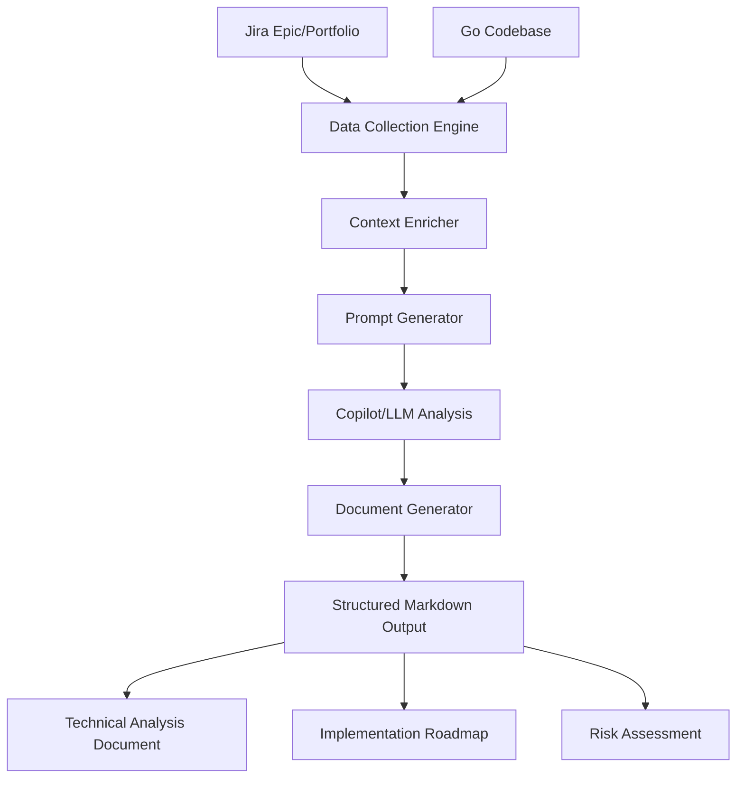
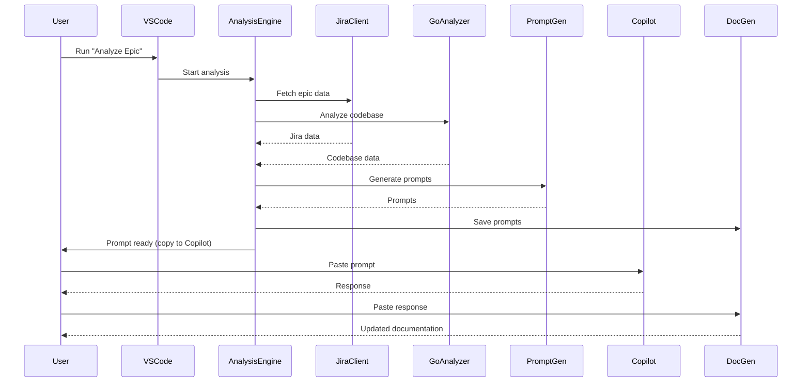

# AI Product Owner Agent - Product Requirements Document (PRD)

---

## Executive Summary
The AI Product Owner Agent is an advanced VS Code extension and CLI tool that automates the technical analysis of Jira epics and Go codebases. It generates comprehensive, implementation-ready technical documentation and prompt workflows for GitHub Copilot (or any LLM), saving engineering teams days of manual effort and ensuring consistent, high-quality output. This product is designed for engineering leaders, product owners, and organizations seeking to accelerate delivery, improve documentation quality, and standardize technical analysis across teams.

---

## Vision & Value Proposition
- **Vision:** To become the industry standard for automated, AI-driven technical analysis and documentation, bridging the gap between business requirements and engineering execution.
- **Value:**
  - **Save Time:** Reduce analysis from days to under an hour.
  - **Consistency:** Standardize technical documentation and analysis across teams.
  - **Quality:** Leverage best-practice prompt engineering and AI reasoning for principal engineer-level output.
  - **Collaboration:** Output is ready for team review, sprint planning, and onboarding.
  - **Scalability:** Works for any Go codebase and Jira instance; extensible to other languages and platforms.

---

## Problem Statement & Market Context
- **Manual Overhead:** Senior engineers spend days translating Jira requirements into technical designs and task breakdowns.
- **Inconsistent Output:** Technical designs and documentation vary in quality and completeness.
- **Context Gaps:** Lack of structured, repeatable frameworks for technical decision-making.
- **Market Need:** As engineering teams scale, the need for standardized, high-quality technical analysis and documentation grows. AI-driven solutions are the next frontier for productivity and quality.

---

## User Personas & Use Cases
### Personas
- **Engineering Manager:** Wants to accelerate delivery and ensure consistent technical analysis.
- **Product Owner:** Needs actionable, implementation-ready documentation for sprint planning.
- **Principal Engineer:** Seeks to standardize best practices and reduce manual analysis overhead.
- **Startup CTO:** Wants to scale engineering output without scaling headcount.
- **Consultant/Agency:** Needs to deliver high-quality technical docs for client projects, fast.

### Use Cases
- Analyze a new Jira epic and generate a full technical spec in under an hour.
- Standardize technical documentation for onboarding and cross-team collaboration.
- Rapidly assess technical risk and implementation complexity for new features.
- Generate Jira-ready task breakdowns and implementation plans.
- Use as a PoC to demonstrate AI-driven analysis to stakeholders or investors.

---

## Competitive Landscape & Differentiation
- **Manual Analysis:** Slow, inconsistent, and dependent on individual expertise.
- **Traditional Tools:** Jira, Confluence, and static documentation tools lack automation and AI-driven insights.
- **Other AI Tools:** Most focus on code generation, not technical analysis or documentation.
- **AI Product Owner Agent:**
  - End-to-end workflow from Jira to implementation-ready docs
  - Multi-stage, context-rich prompt engineering (Context7/Anthropic style)
  - Deep integration with Copilot/LLMs and Go codebases
  - Extensible, open, and ready for future automation

---

## Solution Overview & Architecture

### High-Level Solution
- Fetches Jira epic/portfolio data and Go codebase structure
- Enriches context and generates multi-stage, context-rich prompts
- Guides Copilot (or any LLM) through a 5-stage technical analysis
- Produces structured, actionable documentation and implementation plans

### Architecture Diagram

### Component Overview
- **VS Code Extension/CLI:** User interface and workflow orchestration
- **Jira Client:** Fetches and parses Jira epic/portfolio data
- **Go Codebase Analyzer:** Analyzes Go project structure, patterns, and complexity
- **Prompt Generator:** Creates context-rich, multi-stage prompts using best practices
- **Document Generator:** Manages output files and documentation
- **Copilot/LLM Integration:** Executes prompts and generates technical analysis

### Sequence Diagram: End-to-End Analysis

---

## End-to-End Workflow
### Current (Semi-Automated)
1. **User triggers analysis** (VS Code command or CLI)
2. **Jira and codebase data collected**
3. **Context is enriched and prompts are generated**
4. **User pastes prompts into Copilot, receives responses**
5. **User pastes Copilot responses into documentation**
6. **Extension saves and updates output files**
7. **All output is version-controlled and ready for implementation**

### Future (Fully Automated Vision)
- Direct Copilot/LLM integration for automatic response ingestion and file updates
- End-to-end, hands-free technical analysis and documentation
- Support for additional languages, frameworks, and platforms

---

## Prompt Engineering Philosophy
- **Context7/Anthropic-Style Prompts:** Multi-step, context-rich, and role-specific
- **Explicit Instructions:** Prompts tell Copilot/LLM exactly what to do, including file update instructions
- **Progressive Analysis:** Each stage builds on the previous, ensuring depth and consistency
- **Visual Requirements:** Prompts require Mermaid diagrams and technical visuals
- **Quality Standards:** Principal Engineer-level analysis, implementation-ready output

---

## Output Artifacts & Business Value
- `TECHNICAL_ANALYSIS.md`: Main analysis document, ready for engineering review and implementation
- `PROMPTS.md`: All generated prompts, reusable and auditable
- `AUTOMATION_SUMMARY.md`: Workflow summary and next steps
- **Jira-Ready Task Breakdown:** Actionable tasks for sprint planning
- **Diagrams & Visuals:** Mermaid diagrams for architecture, flows, and dependencies
- **Decision Log & Risk Assessment:** Captures key decisions and risks for future reference

---

## Roadmap & Future Enhancements
- **Automated Copilot/LLM Response Ingestion**
- **Support for Additional Languages/Frameworks**
- **Deeper Jira/GitHub API Integration**
- **Customizable Prompt Templates and Workflows**
- **Enterprise Features:** SSO, audit logs, advanced permissions
- **Cloud/Hosted Version**

---

## FAQ & Troubleshooting
### FAQ
- **Q: Do I need GitHub Copilot to use this?**
  - A: No, you can use any LLM (Claude, ChatGPT, etc.) with the generated prompts.
- **Q: Can I use this with other languages?**
  - A: Currently optimized for Go, but extensible to other languages.
- **Q: Is my data secure?**
  - A: All credentials are stored securely in VS Code's secrets storage. No data is sent externally except to Jira and Copilot/LLM.
- **Q: Can I customize the prompts?**
  - A: Yes, prompt templates are extensible and can be tailored to your workflow.
- **Q: How do I contribute?**
  - A: See the Developer Guide for contribution guidelines.

### Troubleshooting
- **Jira authentication failed:** Check API token and email.
- **Epic not found:** Verify epic key and permissions.
- **No Go files found:** Check project path and structure.
- **Copilot integration issue:** Ensure Copilot extension is installed and active.
- **Rate limit exceeded:** Wait and retry, or adjust network settings.

---

## Glossary
- **Epic:** A large body of work in Jira, typically spanning multiple sprints.
- **LLM:** Large Language Model (e.g., Copilot, ChatGPT, Claude)
- **Prompt Engineering:** The art of crafting effective instructions for LLMs.
- **Mermaid Diagrams:** Markdown-based diagrams for architecture and flows.
- **Principal Engineer:** Senior technical leader responsible for architecture and design.

---

*For detailed architecture and workflow, see [ARCHITECTURE.md](ARCHITECTURE.md). For user and developer instructions, see [USER_GUIDE.md](USER_GUIDE.md) and [DEVELOPER_GUIDE.md](DEVELOPER_GUIDE.md).* 