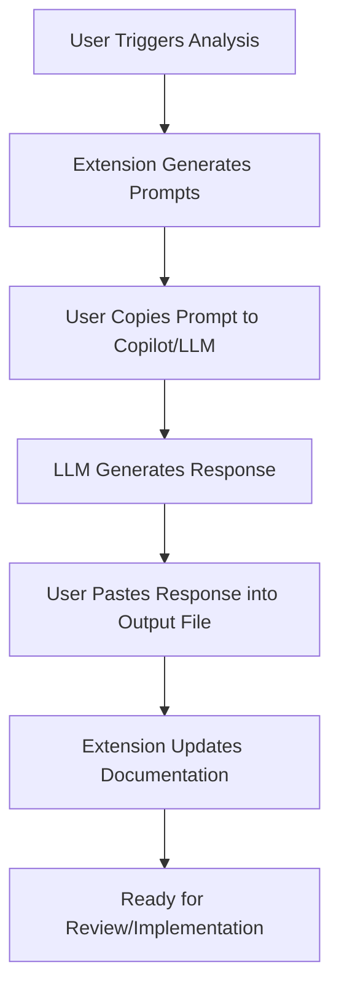

# AI Product Owner Agent - User Guide

## 📋 Table of Contents
1. [Getting Started](#getting-started)
2. [Installation & Setup](#installation--setup)
3. [Configuration](#configuration)
4. [Using the Extension](#using-the-extension)
5. [Workflow Examples](#workflow-examples)
6. [Troubleshooting](#troubleshooting)
7. [Best Practices](#best-practices)
8. [FAQ](#faq)

## 🚀 Getting Started

The AI Product Owner Agent helps you analyze Jira epics and Go codebases to generate comprehensive technical documentation using GitHub Copilot or any LLM. This extension transforms business requirements into actionable technical designs with visual diagrams and implementation plans.

### What You'll Need
- ✅ VS Code (version 1.74.0 or higher)
- ✅ Jira instance with API access
- ✅ Jira API token
- ✅ Go workspace (optional but recommended)
- ✅ GitHub Copilot extension (or any LLM)

### Key Features
- 🔍 **Epic Analysis**: Fetch and analyze Jira epics with stories
- 🏗️ **Codebase Integration**: Analyze Go project structure and patterns
- 🤖 **AI-Powered Prompts**: Generate specialized prompts for Copilot/LLMs
- 📊 **Visual Documentation**: Create Mermaid diagrams and technical specs
- 🔄 **Multi-Stage Analysis**: 5-stage comprehensive analysis workflow

## 📦 Installation & Setup

### Step 1: Install the Extension
1. Open VS Code
2. Go to Extensions (Ctrl+Shift+X / Cmd+Shift+X)
3. Search for "AI Product Owner Agent"
4. Click "Install"

### Step 2: Get Your Jira API Token
1. Go to [Atlassian Account Settings](https://id.atlassian.com/manage-profile/security/api-tokens)
2. Click "Create API token"
3. Give it a name like "AI Product Owner Agent"
4. Copy the generated token (save it securely!)

### Step 3: First-Time Setup
When you first activate the extension, you'll see a welcome message:

```
🚀 Welcome to AI Product Owner Agent!
Would you like a quick walkthrough to get started?
```

Choose "Configure Now" to set up your credentials immediately.

## ⚙️ Configuration

### Open Configuration Settings
Use any of these methods:
- **Command Palette**: `Ctrl+Shift+P` → "AI Product Owner: Configure Settings"
- **Activity Bar**: Click the robot icon → Configure Settings
- **Settings Menu**: File → Preferences → Settings → Search "AI Product Owner"

### Required Settings

#### Jira Configuration
```json
{
  "aiProductOwner.jira.baseUrl": "your-company.atlassian.net",
  "aiProductOwner.jira.email": "your-email@company.com",
  "aiProductOwner.jira.token": "your-api-token-here"
}
```

**⚠️ Important**: Don't include `https://` in the base URL - just use `company.atlassian.net`

#### Output Configuration
```json
{
  "aiProductOwner.output.directory": "./docs/analysis",
  "aiProductOwner.output.generateDiagrams": true
}
```

#### Analysis Configuration
```json
{
  "aiProductOwner.analysis.maxSolutions": 2,
  "aiProductOwner.codebase.includeTests": false
}
```

### Test Your Configuration
After setting up, test your connection:
1. Open Command Palette (`Ctrl+Shift+P`)
2. Run "AI Product Owner: Test Jira Connection"
3. Wait for the connection test to complete

You should see: ✅ "Jira connection successful!"

## 🎯 Using the Extension

### Visual Workflow Overview


### Basic Workflow

#### 1. Open Your Go Project
```bash
# Open your Go project in VS Code
code /path/to/your/go/project
```

#### 2. Start Epic Analysis
- **Command Palette**: `Ctrl+Shift+P` → "AI Product Owner: Analyze Epic"
- **Keyboard Shortcut**: `Ctrl+Shift+A` (Windows/Linux) or `Cmd+Shift+A` (Mac)
- **Activity Bar**: Click the robot icon → "Analyze Epic"

#### 3. Enter Epic Key
When prompted, enter your Jira epic key (e.g., `PROJ-123`).

#### 4. Watch the Analysis Progress
The extension will show detailed progress as it fetches Jira data, analyzes the codebase, and generates prompts.

#### 5. Execute Multi-Stage Analysis
The extension guides you through 5 analysis stages:
1. **🎯 Business Analysis**
2. **🏗️ Technical Architecture**
3. **⚙️ Implementation Design**
4. **📋 Development Plan**
5. **⚠️ Risk Assessment**

For each stage:
- Click "Copy Prompt" to copy the generated prompt
- Paste the prompt into Copilot Chat (or your LLM of choice)
- Wait for the LLM's complete response
- Copy the response and paste it into the designated section of the output file
- Click "Stage Complete" to continue

### Output Structure
After analysis, you'll find generated files in:
```
your-project/
└── docs/analysis/PROJ-123/
    ├── 01-business-analysis.md
    ├── 02-technical-architecture.md
    ├── 03-implementation-design.md
    ├── 04-development-plan.md
    ├── 05-risk-assessment.md
    └── analysis-summary.md
```

## 📝 Workflow Examples

### Example 1: User Authentication Epic
**Epic**: `AUTH-101 - Implement OAuth 2.0 Authentication`
- Stories: 5 stories, 34 story points
- Codebase: 45 Go files, JWT patterns detected
- Components: auth-service, user-management

**Generated Output:**
- Business requirements analysis with stakeholder mapping
- Technical architecture with OAuth 2.0 flow diagrams
- Implementation design with API specifications
- Development timeline with task breakdown
- Risk assessment with security considerations

### Example 2: Microservice Migration
**Epic**: `BACKEND-205 - Migrate Monolith to Microservices`
- Stories: 12 stories, 89 story points
- Codebase: 200+ Go files, Database patterns
- Components: user-service, order-service, payment-service

**Generated Output:**
- Service boundary analysis
- Migration strategy with dependency mapping
- Database decomposition plan
- Deployment and monitoring strategy
- Risk mitigation for data consistency

## 🛠️ Troubleshooting

### Common Issues & Solutions
- **Jira authentication failed:** Check API token and email.
- **Epic not found:** Verify epic key and permissions.
- **No Go files found:** Check project path and structure.
- **Copilot integration issue:** Ensure Copilot extension is installed and active.
- **Rate limit exceeded:** Wait and retry, or adjust network settings.

### Debug Mode
Enable verbose logging for detailed troubleshooting:
```json
{
  "aiProductOwner.debug.enableVerboseLogging": true
}
```
Check the output panel: View → Output → "AI Product Owner - Error Handler"

### Getting Help
- Check Output Panel: View → Output → "AI Product Owner"
- Test individual components: Use "Test Jira Connection" command
- Reset configuration: Use "AI Product Owner: Configure Settings"

## 💡 Best Practices
- **Epic Selection:** Choose well-defined epics with clear stories and acceptance criteria
- **Codebase Preparation:** Organize Go files in logical packages; ensure `go.mod` is up to date
- **Prompt Optimization:** Review generated prompts before using; add context as needed
- **Output Management:** Commit generated documentation to Git; re-run analysis when epics change
- **Quality Assurance:** Validate diagrams, review technical decisions, and test implementation plans

## ❓ FAQ

### General
- **Q: Do I need GitHub Copilot to use this extension?**
  - A: No, you can use any LLM (Claude, ChatGPT, etc.) with the generated prompts.
- **Q: Can I use this with other programming languages?**
  - A: Currently optimized for Go, but extensible to other languages.
- **Q: Where are my API tokens stored?**
  - A: Tokens are stored securely in VS Code's built-in secrets storage.
- **Q: Can I customize the prompt templates?**
  - A: Yes, prompt templates are extensible and can be tailored to your workflow.

### Usage
- **Q: How long does a typical analysis take?**
  - A: 30-60 minutes total, depending on epic complexity and LLM interaction.
- **Q: Can I pause and resume analysis?**
  - A: Yes, the extension supports pausing between stages.
- **Q: What if my epic changes during analysis?**
  - A: Re-run the analysis to get updated prompts and documentation.

### Advanced
- **Q: How do I integrate this with CI/CD?**
  - A: Generate documentation as part of your workflow and commit the output to version control.
- **Q: Can I automate epic analysis?**
  - A: The extension is designed for interactive use, but automation is on the roadmap.
- **Q: How do I contribute improvements?**
  - A: See the Developer Guide for contribution guidelines.

## 🎯 Next Steps
1. **Complete Setup:** Ensure Jira connection is working
2. **Try First Epic:** Start with a small, well-defined epic
3. **Explore Features:** Test different types of epics and codebases
4. **Share Results:** Show generated documentation to your team
5. **Provide Feedback:** Help improve the extension with your experience

For technical details and customization options, see the [Developer Guide](DEVELOPER_GUIDE.md). 